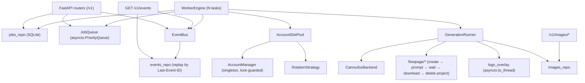
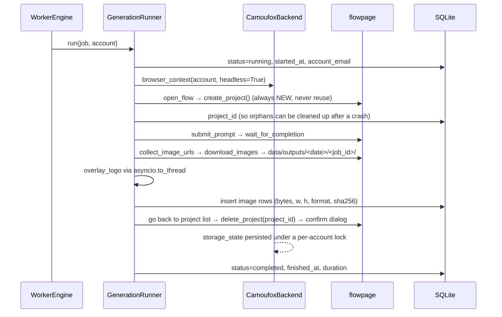
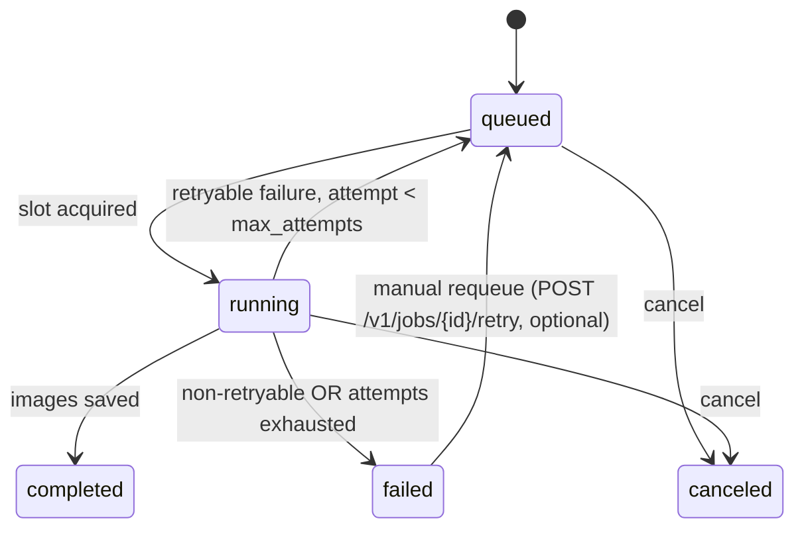

# Flow Service — REST API + SSE Backend: Analysis, Design & Task Plan

**Status:** Implemented (Phases 0–8 done as of 2026-08-15; Phase 9 live verification pending) · **Target version:** 0.2.0 · **Written:** 2026-08-15

Turns the current library+CLI (`google_flow_wrapper`) into a long-running Python backend service
that accepts batch image-generation requests over HTTP, executes them across a pool of Google
accounts, streams job status over SSE, and serves/lists the produced images.

Related docs:
[architecture.md](../google-flow-wrapper-module/architecture.md) (how the current code works) ·
[google-flow-wrapper-requirement.md](../google-flow-wrapper-module/google-flow-wrapper-requirement.md).

---

## 1. Analysis of the current architecture

### 1.1 What we can reuse as-is

| Component | Reuse verdict |
|---|---|
| `flowpage/*` (navigate, prompt, wait, download, selectors) | **As-is.** Pure `Page` functions, no global state. |
| `browser/camoufox_backend.py`, `browser/proxy.py`, `humanize.py` | **As-is.** |
| `auth/login.py`, `auth/session_check.py` | **As-is**, but interactive login stays CLI-only (needs a headed browser + a human). |
| `postprocess/logo_overlay.py` | Reuse, but **must be called off the event loop** (see 1.2.6). |
| `accounts/manager.py`, `accounts/store.py` | Reuse with a **process-wide singleton + write lock** (see 1.2.2). |
| `models.py`, `errors.py`, `paths.py`, `config.py` | Reuse + extend. |
| `rotation/strategy.py` | As-is. |
| `rotation/limiter.py`, `rotation/scheduler.py` | **Must change** — see 1.2.1, the single biggest blocker. |
| `client.py` `FlowClient` | Keep as the CLI-facing facade; extract the page-driving body into a reusable `GenerationRunner` the worker calls. |

### 1.2 Blockers found in the current code

**1.2.1 — The scheduler cannot express "queue until an account frees up" (critical).**
`JobScheduler.run` calls `strategy.select(available)` *before* it knows whether that account has a
free slot, then `await limiter.acquire(email)` blocks on **that one account's** semaphore. With 4
accounts × 2 slots, 8 concurrent jobs can all pile onto one email while the others sit idle. Fix:
selection must be *capacity-aware* — pick among accounts that have a free slot, and only block when
**every** account is saturated. This requires a new `AccountSlotPool` (§4.3).

**1.2.2 — `AccountManager` is a load-once, in-memory cache over a YAML file.**
It reads `accounts.yaml` in `__init__` and rewrites the whole file on every mutation. In a server:
- Multiple `AccountManager` instances (one per request/`FlowClient`) would produce lost updates →
  the service must construct exactly **one** instance and share it.
- Every `record_success`/`record_failure`/`set_cooldown` does a synchronous full-file write on the
  event loop → wrap mutations in an `asyncio.Lock` and run the write via `asyncio.to_thread`.
- A concurrently-run `flow account ...` CLI command **will** clobber server-side updates. Documented
  constraint: while the service runs, account mutations go through the service (§6.7).

**1.2.3 — Project reuse is unsafe under concurrency.**
`navigate.ensure_project(reuse_latest=True)` opens the newest existing project and
`collect_existing_image_urls` snapshots a baseline to tell new images apart. Two concurrent jobs on
the same account would land in the **same** project and steal each other's results. The adopted
model (**new project per image → generate → delete project**) fixes this and also makes the
baseline always empty. Requires a new `navigate.create_project()` (never reuse) and a
`navigate.delete_project()`; the delete control **has now been located in the DOM** (§6.2).

**1.2.4 — Concurrent `storage_state.json` writes for the same account.**
`CamoufoxBackend.browser_context` writes `data/sessions/<email>/storage_state.json` on **every**
context exit. With per-account concurrency ≥ 2, two contexts can write the same file at once →
truncated/corrupt session, which surfaces later as a spurious `needs_login`. Fix: per-account
`asyncio.Lock` around the write **and** an atomic write (temp file + `os.replace`), same technique
`accounts/store.py` already uses.

**1.2.5 — One full Camoufox browser per job.**
`per_account_concurrency=2` × N accounts = 2N simultaneous Firefox processes (~300–500 MB each).
Needs a hard global ceiling (`max_concurrent_browsers`) independent of per-account limits, plus a
documented sizing table. Sharing one browser across contexts per account is a possible later
optimization but is *not* in scope (it complicates fingerprint isolation and session persistence).

**1.2.6 — Blocking calls inside `async def`.**
`_apply_logo_overlay` runs `subprocess.run("ffmpeg", ...)` and `Path.read_bytes()` synchronously
inside the async generation path. In a CLI that's harmless; in a server it stalls **every** other
job, the SSE stream, and HTTP handlers for the duration. Fix: `await asyncio.to_thread(...)`.

**1.2.7 — `GeneratedImage.content` keeps every image's bytes in memory** and `_apply_logo_overlay`
re-reads the file into `content` after overlaying. For batches this is unbounded memory growth. In
the service path, drop `content` after the file is written and pass paths only.

**1.2.8 — Failure handling is error-type-agnostic** (known gap in architecture.md §11.2): every
exception → flat 5-minute cooldown. A service needs `AuthError` → `needs_login` (stop selecting the
account entirely, alert the operator), `QuotaExceededError` → long cooldown (hours),
`SelectorNotFoundError` → **do not** cooldown the account (it's a code/UI bug, not the account's
fault; retrying elsewhere just burns every account).

**1.2.9 — No logging is wired in** (known gap §11.1). A background service with no logs is
undebuggable. `logging_setup.configure_logging()` must be called at startup and the worker/runner
must emit structured events.

**1.2.10 — `flowpage.wait` treats a partial result as success**, and `flowpage.params` calls are
commented out in `client.py` — so `model`/`aspect_ratio`/`count` are currently **accepted and
ignored**. The API must not advertise fields it silently drops (§3.4).

---

## 2. Requirements

### 2.1 Functional (from the request)

| ID | Requirement |
|---|---|
| S-01 | REST endpoint to submit generation work; supports **batches** (many prompts in one call). |
| S-02 | Each image is produced in its **own fresh Flow project**, which is deleted afterwards. |
| S-03 | Per-account concurrency limit, configurable, default **2**; because of S-02 this is simultaneously the limit on concurrent *projects* and concurrent *images* per account. When all accounts are saturated, new work **queues**. |
| S-04 | SSE endpoint streaming job/batch status transitions (`queued`, `running`, `completed`, `failed`, …). |
| S-05 | SQLite persistence of job/batch metadata; basis for ETA estimation per job and per batch. |
| S-06 | REST endpoint listing currently running jobs. |
| S-07 | REST endpoint serving generated image files. |
| S-08 | REST endpoint listing available images with pagination + metadata (created date, size, …). |
| S-09 | No test code: the existing `tests/` suite is deleted and no new tests are added. |

### 2.2 Additional requirements identified during analysis

| ID | Requirement | Why |
|---|---|---|
| S-10 | **Cancel** a queued/running job or a whole batch | A 500-prompt batch with a broken selector must be stoppable without killing the process. |
| S-11 | **Crash recovery**: on startup, jobs left `running` are re-queued (bounded by `max_attempts`) | The process owns all in-flight state; a restart otherwise strands jobs forever. |
| S-12 | **Graceful shutdown**: stop intake, let in-flight jobs finish (bounded), close browsers | Killing Camoufox mid-write corrupts `storage_state.json`. |
| S-13 | **API key auth** (`X-API-Key`) + configurable CORS allowlist | The service drives logged-in Google accounts; an open endpoint is account theft-by-proxy. |
| S-14 | **Input limits**: max prompts/batch, max prompt length, max `count`, allowed aspect ratios | Unbounded batch → unbounded queue → memory + disk exhaustion (OWASP A04). |
| S-15 | **Path-traversal-safe file serving**: serve by image **id** resolved from the DB, never by client-supplied path | OWASP A01. |
| S-16 | **Idempotency key** on submit | HTTP retries must not double-charge account quota. |
| S-17 | **Accounts/capacity endpoint** (`available`, `busy`, `needs_login`, free slots, queue depth) | Operators need to see *why* everything is queued. |
| S-18 | **Health/readiness endpoints** (`/healthz`, `/readyz`) | `/readyz` fails when zero accounts are usable or ffmpeg/Camoufox is missing. |
| S-19 | **Structured logging** wired into worker/runner/API with a `job_id`/`batch_id` correlation id | §1.2.9. |
| S-20 | **Image indexing/backfill**: existing files in `data/outputs/` are indexed into SQLite at startup | S-08 must list images generated before the service existed. |
| S-21 | **Thumbnails** for the image list (Pillow, already a dependency) | Listing pages must not download full-size images. |
| S-22 | **Retention/cleanup** job — **DEFERRED** (decision 3): `data/outputs/` is permanent for now. A `StorageBackend` seam is introduced so a cloud blob backend can replace local disk later without touching the API. | Disk growth is accepted; cloud offload is the planned answer, not deletion. |
| S-23 | **Priority + FIFO ordering** of the queue | Interactive single requests shouldn't sit behind a 200-image batch. |
| S-24 | **Per-job artifact directory** `data/outputs/<yyyy-mm-dd>/<job_id>/` | Flat `outputs/` becomes unlistable at scale; per-job dirs make cleanup atomic. |
| S-25 | Optional **webhook callback** on batch completion | Not all clients can hold an SSE connection. Nice-to-have, last phase. |

### 2.3 Non-functional

- Single process, single event loop, **`--workers 1`** (in-memory queue + slot pool + one
  `AccountManager` are process-local; multiple workers would double-book accounts).
- Python ≥ 3.11, asyncio-native, `mypy --strict` and `ruff` clean (existing project standard).
- Windows-first (dev box is Windows); no POSIX-only syscalls in new code.
- Backwards compatible: `flow generate`/`generate-batch` CLI keeps working unchanged.

### 2.4 Out of scope

Multi-node/horizontal scaling, Postgres/Redis, user accounts & RBAC, video generation, live
interactive login over HTTP, real-time browser streaming/VNC, **reference-image (image-to-image)
upload over HTTP** (decision 5 — `GenerationRequest.reference_images` stays a library/CLI-only
field and is not exposed by the API), automatic output retention/pruning (decision 3).

---

## 3. API design

Base path `/v1`. All endpoints except `/healthz` require `X-API-Key`; if no key is configured the
service **generates and persists one on first start** (§6.9) rather than running unauthenticated.
Errors use a single envelope: `{"error": {"code": "...", "message": "...", "details": {...}}}`.

### 3.1 Generation

```http
POST /v1/generations
Content-Type: application/json
X-API-Key: ...
Idempotency-Key: 6f1c...        # optional

{
  "prompts": ["a red apple on a table", "a vintage typewriter"],   # 1..max_batch_prompts
  "count": 1,                    # images per prompt, 1..4
  "model": null,                 # see §3.4 — currently advisory only
  "aspect_ratio": null,          # see §3.4
  "priority": 0,                 # higher runs first; default 0
  "timeout_seconds": 180,
  "overlay_logo": true,
  "metadata": {"source": "video_pilot"}   # opaque, stored and echoed back
}
```

```http
202 Accepted
{
  "batch_id": "btc_01J...",
  "status": "queued",
  "jobs": [
    {"job_id": "job_01J...", "prompt": "a red apple on a table", "status": "queued", "queue_position": 3},
    {"job_id": "job_01J...", "prompt": "a vintage typewriter",   "status": "queued", "queue_position": 4}
  ],
  "estimated_start_at": "2026-08-15T10:04:11Z",
  "estimated_finish_at": "2026-08-15T10:09:40Z"
}
```

One job = one prompt, and one job = **one Flow project** (created, used, deleted). `count > 1`
still yields one job in one project (Flow produces N images from one submission). There is no
`reference_images` field — image-to-image is not exposed over HTTP (decision 5).

### 3.2 Job & batch queries

| Method | Path | Purpose |
|---|---|---|
| `GET` | `/v1/jobs?status=&batch_id=&page=&page_size=&order=` | Paginated job list (`status` repeatable). |
| `GET` | `/v1/jobs/running` | **S-06.** Jobs currently `running`, with `account_email`, `started_at`, `elapsed_seconds`, `eta_seconds`. |
| `GET` | `/v1/jobs/{job_id}` | Full job record + its images + attempt history. |
| `POST` | `/v1/jobs/{job_id}/cancel` | **S-10.** `queued` → `canceled` immediately; `running` → cooperative cancel. |
| `GET` | `/v1/batches/{batch_id}` | Aggregate counts by status, progress %, ETA. |
| `POST` | `/v1/batches/{batch_id}/cancel` | Cancels all non-terminal jobs in the batch. |

### 3.3 Events (SSE) — S-04

```http
GET /v1/events?batch_id=&job_id=&types=job.status,batch.status
Accept: text/event-stream
Last-Event-ID: 41207          # replayed from the job_events table
```

```
id: 41208
event: job.status
data: {"job_id":"job_01J...","batch_id":"btc_01J...","status":"running","account_email":"a@b.com","attempt":1,"at":"2026-08-15T10:04:12Z"}

id: 41209
event: job.progress
data: {"job_id":"job_01J...","stage":"waiting_for_result","elapsed_seconds":22.4,"eta_seconds":38}

: heartbeat
```

Event types: `job.queued`, `job.status`, `job.progress`, `job.completed`, `job.failed`,
`job.canceled`, `batch.status`, `batch.completed`, `queue.stats` (periodic depth/capacity/ETA).
Design points:
- Every event is **persisted first** to `job_events` (monotonic `seq` = SSE `id`), then fanned out.
  This makes `Last-Event-ID` reconnect-replay exact rather than best-effort.
- Each subscriber gets a bounded `asyncio.Queue`; on overflow the slow client is dropped with a
  `stream.overflow` event (never block the producer).
- 15 s comment heartbeats keep proxies from idling the connection out; `X-Accel-Buffering: no`.

### 3.4 Honesty about `model` / `aspect_ratio` / `count`

`params.set_model`/`set_aspect_ratio`/`set_count` are **commented out** in `client.py` and were never
verified live. Until Phase 9 verifies them, the API accepts these fields, stores them, and returns
`"applied_params": {"model": false, "aspect_ratio": false, "count": true}` on the job record, plus a
one-line warning in the response `warnings[]`. Do not silently pretend they took effect.

### 3.5 Images — S-07, S-08

| Method | Path | Purpose |
|---|---|---|
| `GET` | `/v1/images?page=1&page_size=50&from=&to=&job_id=&batch_id=&order=created_at:desc` | Paginated metadata list: `id`, `job_id`, `prompt`, `created_at`, `bytes`, `width`, `height`, `format`, `sha256`, `url`, `thumbnail_url`. |
| `GET` | `/v1/images/{image_id}` | Single image metadata. |
| `GET` | `/v1/images/{image_id}/file` | The file itself: `FileResponse`, `ETag`, `Last-Modified`, `Cache-Control: private, max-age=86400`, 304 support. |
| `GET` | `/v1/images/{image_id}/thumbnail?w=256` | Cached thumbnail (**S-21**). |

Pagination envelope: `{"items": [...], "page": 1, "page_size": 50, "total": 1234, "has_next": true}`.
Keyset pagination (`created_at, id` cursor) is preferred for `order=created_at:desc` on large sets;
offset pagination is acceptable for v1 given expected volumes.

**Security (S-15):** the path is never taken from the client. The DB stores a path *relative to*
`outputs_dir`; the handler joins it and asserts
`resolved.is_relative_to(outputs_dir.resolve())` before serving, rejecting anything else with 404.

### 3.6 Operations

| Method | Path | Purpose |
|---|---|---|
| `GET` | `/healthz` | Liveness — process is up. |
| `GET` | `/readyz` | Readiness — DB reachable, Camoufox installed, ffmpeg present (if overlay on), ≥1 usable account. |
| `GET` | `/v1/accounts` | **S-17.** Per account: status, in-flight/limit, success/fail counts, `cooldown_until`, `last_used_at`. |
| `GET` | `/v1/stats` | Queue depth by status, total/free slots, throughput (jobs/hr), rolling avg duration, ETA for the whole queue, plus `images_total`/`bytes_total` (disk growth monitoring, §6.10). |

---

## 4. Service architecture

### 4.1 New layout

```
src/google_flow_wrapper/
├── ... (existing modules unchanged unless noted)
├── service/
│   ├── app.py              # FastAPI app factory + lifespan (startup/shutdown wiring)
│   ├── deps.py             # DI: settings, container accessors, API-key guard
│   ├── container.py        # ServiceContainer: singletons (db, bus, queue, pool, engine, manager)
│   ├── schemas.py          # Pydantic request/response models (API contract only)
│   ├── errors.py           # exception handlers → error envelope
│   ├── eta.py              # rolling-average duration + queue ETA math
│   └── routers/
│       ├── generations.py  # POST /v1/generations
│       ├── jobs.py         # /v1/jobs*, /v1/batches*
│       ├── events.py       # GET /v1/events (SSE)
│       ├── images.py       # /v1/images*
│       └── ops.py          # /healthz, /readyz, /v1/accounts, /v1/stats
├── db/
│   ├── engine.py           # aiosqlite connection, WAL/pragmas, migration runner
│   ├── migrations.py       # ordered DDL statements, schema_version table
│   ├── jobs_repo.py        # batches/jobs CRUD + queue queries
│   ├── images_repo.py      # image metadata CRUD, listing, backfill
│   └── events_repo.py      # append + replay job_events
├── worker/
│   ├── engine.py           # WorkerEngine: dispatch loop, N worker tasks, cancellation
│   ├── runner.py           # GenerationRunner: one job → browser → project → images (extracted from client.py)
│   ├── bus.py              # EventBus: persist-then-fanout, bounded subscriber queues
│   └── recovery.py         # startup re-queue of orphaned `running` jobs (S-11)
└── rotation/
    └── pool.py             # AccountSlotPool: capacity-aware account acquisition (§4.3)
```

### 4.2 Component diagram



### 4.3 `AccountSlotPool` (fixes §1.2.1)

Replaces the "select then block" behaviour. In-memory, single-process, no DB round-trip:

```python
class AccountSlotPool:
    async def acquire(self, *, exclude: set[str] = frozenset()) -> AccountSlot: ...
    # 1. candidates = [a for a in accounts.get_available()
    #                  if a.email not in exclude and self._in_flight[a.email] < per_account_limit]
    # 2. also require self._total_in_flight < max_concurrent_browsers
    # 3. if candidates: pick via RotationStrategy, increment counters, return a slot handle
    # 4. else: await self._condition.wait()  # woken on release() or on an account status change
    def release(self, slot) -> None: ...     # decrement + notify_all
    def snapshot(self) -> PoolStats: ...     # free/total slots, per-account in-flight  → /v1/stats
```

`ConcurrencyLimiter` keeps its current shape for the CLI path; the pool supersedes it in the
service path. `JobScheduler` is **not** used by the service (its retry loop is replaced by
DB-backed attempts so retries survive restarts).

### 4.4 Queue & worker engine

- **Queue:** in-memory `asyncio.PriorityQueue` of `(-priority, queued_at, job_id)`, hydrated from
  SQLite at startup (`status IN ('queued','running')`, running ones re-queued per S-11). SQLite is
  the durable source of truth; the in-memory queue is a fast index over it.
- **Dispatch loop:** pop job id → `await pool.acquire(exclude=job.attempted_emails)` (this is where
  work *waits* when everything is busy) → mark `running` in DB + emit event → spawn a task.
- **Worker task:** `GenerationRunner.run(job, account)`; on return, release the slot and record
  the outcome. Bounded by `max_concurrent_browsers` globally.
- **Retries:** on failure, if `attempt < max_attempts` and the error is retryable, the job goes back
  to `queued` with `attempt += 1` and `attempted_emails += [email]`, so it lands on a *different*
  account (mirrors today's `JobScheduler` semantics, but persisted). Otherwise → `failed`.
- **Cancellation:** `queued` → flip to `canceled` in the DB, dispatch loop skips it. `running` → a
  per-job `asyncio.Event`/`Task.cancel()`; the runner's `finally` still closes the browser context
  and deletes the temp Flow project.

### 4.5 `GenerationRunner` — per-job flow (S-02)



Notes:
- Images are downloaded **before** the project is deleted — the media URLs are backed by the
  project and must be assumed dead afterwards.
- Project deletion is **best-effort**: a failure is logged and recorded as
  `project_cleanup_failed`, never converts a successful generation into a failure. A periodic
  sweeper retries orphaned projects (§6.2).
- Because the project is brand new and empty, `baseline_urls` is empty — the fragile
  "tell new images from old" logic effectively disappears.
- `reuse_latest_project` remains the CLI default; the service always uses fresh projects.

### 4.6 Status model



Batch status is derived: `queued` → `running` (any job running) → `completed` (all completed) /
`partially_failed` (mixed) / `failed` (all failed) / `canceled`.

### 4.7 Error → account-status mapping (fixes §1.2.8)

| Exception | Job outcome | Account effect |
|---|---|---|
| `AuthError` | retry on another account | `needs_login` (removed from rotation, surfaced in `/v1/accounts`) |
| `QuotaExceededError` | retry on another account | cooldown `quota_cooldown_minutes` (default 120) |
| `GenerationTimeoutError` | retry | short cooldown (default 5 min) |
| `SelectorNotFoundError` | **fail fast**, no retry on other accounts | **no** cooldown (it's a code/UI bug) |
| `PlaywrightError`/browser crash | retry | short cooldown |
| Unknown `Exception` | retry | short cooldown |

---

## 5. Data model (SQLite) — S-05

File: `data/flow.db`. `aiosqlite`, `journal_mode=WAL`, `busy_timeout=5000`,
`foreign_keys=ON`, `synchronous=NORMAL`. Migrations are an ordered list of DDL strings applied
against a `schema_version` table (no Alembic — overkill for a single-file DB).

```sql
CREATE TABLE batches (
  id TEXT PRIMARY KEY,
  status TEXT NOT NULL,                -- queued|running|completed|partially_failed|failed|canceled
  job_count INTEGER NOT NULL,
  idempotency_key TEXT UNIQUE,
  metadata TEXT,                       -- JSON
  created_at TEXT NOT NULL,
  updated_at TEXT NOT NULL
);

CREATE TABLE jobs (
  id TEXT PRIMARY KEY,
  batch_id TEXT NOT NULL REFERENCES batches(id) ON DELETE CASCADE,
  prompt TEXT NOT NULL,
  model TEXT, aspect_ratio TEXT,
  count INTEGER NOT NULL DEFAULT 1,
  timeout_seconds REAL NOT NULL,
  overlay_logo INTEGER NOT NULL DEFAULT 1,
  priority INTEGER NOT NULL DEFAULT 0,
  status TEXT NOT NULL,                -- queued|running|completed|failed|canceled
  attempt INTEGER NOT NULL DEFAULT 0,
  max_attempts INTEGER NOT NULL DEFAULT 3,
  attempted_emails TEXT NOT NULL DEFAULT '[]',   -- JSON array
  account_email TEXT,
  project_id TEXT,                     -- Flow project, for orphan cleanup
  error_code TEXT, error_message TEXT,
  queued_at TEXT NOT NULL, started_at TEXT, finished_at TEXT,
  duration_seconds REAL,
  created_at TEXT NOT NULL, updated_at TEXT NOT NULL
);
CREATE INDEX ix_jobs_status_priority ON jobs(status, priority DESC, queued_at);
CREATE INDEX ix_jobs_batch ON jobs(batch_id);

CREATE TABLE images (
  id TEXT PRIMARY KEY,
  job_id TEXT REFERENCES jobs(id) ON DELETE SET NULL,
  storage TEXT NOT NULL DEFAULT 'local',   -- StorageBackend id; 'local' today, e.g. 's3'/'azure' later (§6.9)
  rel_path TEXT NOT NULL UNIQUE,       -- key within the backend; relative to outputs_dir for 'local' (never absolute; see S-15)
  source_url TEXT,
  bytes INTEGER NOT NULL,
  width INTEGER, height INTEGER, format TEXT,
  sha256 TEXT,
  prompt TEXT,                         -- denormalized so /v1/images needs no join
  account_email TEXT,
  thumbnail_rel_path TEXT,
  created_at TEXT NOT NULL             -- file mtime for backfilled rows
);
CREATE INDEX ix_images_created ON images(created_at DESC, id DESC);
CREATE INDEX ix_images_job ON images(job_id);

CREATE TABLE job_events (
  seq INTEGER PRIMARY KEY AUTOINCREMENT,   -- doubles as the SSE event id
  job_id TEXT, batch_id TEXT,
  type TEXT NOT NULL, status TEXT,
  payload TEXT NOT NULL,               -- JSON
  created_at TEXT NOT NULL
);
CREATE INDEX ix_events_job ON job_events(job_id, seq);
CREATE INDEX ix_events_batch ON job_events(batch_id, seq);

CREATE TABLE schema_version (version INTEGER NOT NULL);
```

**ETA model (`service/eta.py`):**
`avg_duration` = mean `duration_seconds` of the last `N=20` completed jobs (fallback: configured
`eta_default_seconds`, 90 s). For a queued job at position `p` (0-based) with `C` total slots:
`eta_start ≈ (p // C) * avg_duration`, `eta_finish ≈ eta_start + avg_duration`. For a running job:
`max(0, avg_duration - elapsed)`. Batch ETA = max over its jobs. Values are explicitly labeled
estimates and returned as `null` until at least 3 completed jobs exist.

---

## 6. Cross-cutting concerns & risks

**6.1 Single process only.** The queue, slot pool and `AccountManager` live in memory. Running
`uvicorn --workers 2` would double-book accounts and corrupt `accounts.yaml`. Enforced at startup:
if `WEB_CONCURRENCY`/`--workers` > 1, log an error and exit.

**6.2 Flow project deletion — control located (decision 1).** The observed flow is:
generate → **navigate back** out of the project (to the project list) → click the project's delete
icon button → a confirmation dialog appears → click its confirm button. Real markup captured:

```html
<button color="BLURPLE" class="sc-e8425ea6-0 hOBPaw …" data-state="closed">
  <i class="google-symbols …" font-size="1rem">delete</i>
  <span style="position:absolute; …clip:rect(0,0,0,0)…">Xoá dự án</span>
</button>
```

Selector strategy (consistent with the rest of `selectors.py`: CSS class hashes are per-build and
visible text is localized, so neither may be used as an anchor):

```python
# Icon-ligature anchor, scoped to the <i> so the localized sr-only <span> can't cause a false match.
PROJECT_DELETE_BUTTON = "button:has(i.google-symbols:text-is('delete'))"
CONFIRM_DIALOG = "[role='dialog'], [role='alertdialog']"
```

The confirmation button's only distinguishing feature is its **localized** label ("Xoá dự án"),
which is the *same string* as the trigger button's screen-reader `<span>`. So `delete_project()`
reads that label off the trigger at runtime and clicks the dialog button carrying the same text —
locale-independent without hardcoding Vietnamese:

```python
label = (await trigger.locator("span").last.inner_text()).strip()   # e.g. "Xoá dự án"
await trigger.click()
dialog = page.locator(CONFIRM_DIALOG).last
await dialog.get_by_role("button", name=label).click()
```

Open sub-questions for live verification (task 9.1):
- **Scoping to the right project.** If the delete button lives on a per-project card in the list,
  it must be resolved *relative to* `a[href*='/project/<project_id>']` (ancestor traversal), not
  page-wide — otherwise a concurrent job's project could be deleted. If instead it lives in the
  project's own header/settings menu, delete from inside the project before navigating away and
  the ambiguity disappears (preferred if available).
- Whether `page.go_back()` or `page.goto(FLOW_URL)` reaches the list reliably.
- Whether the list is virtualized enough that a freshly created project is always rendered.

Safety net kept regardless: deletion is best-effort and never fails a job; a periodic sweeper
(task 8.5) retries orphaned projects using `jobs.project_id`; `delete_project_after_job`
(default `true`) disables it wholesale.

**6.3 Camoufox startup cost & memory.** ~5–15 s per browser launch dominates short jobs.
`max_concurrent_browsers` default 4; document ≈500 MB RSS per browser. A future "warm browser per
account" pool is explicitly deferred.

**6.4 SQLite write contention.** All writes go through one `aiosqlite` connection owned by the
service; WAL + a short `busy_timeout` handles the reader/writer overlap. Never write to the DB from
`asyncio.to_thread` workers directly — go through the repo layer.

**6.5 Security.** API key compared with `secrets.compare_digest`; CORS allowlist (never `*`);
request-size limits and prompt-length caps (S-14); image serving is id-based with a
path containment assertion (S-15); no user input ever reaches a shell (`ffmpeg` is invoked with an
argv list, already correct); DB access is fully parameterized — no string-built SQL; errors returned
to clients are sanitized (no absolute filesystem paths, no account emails on public error bodies).

**6.6 Prompt/`metadata` are stored verbatim** and echoed back in JSON/SSE — clients must treat them
as untrusted text (never render as HTML). Documented in the API README.

**6.7 CLI/server coexistence.** While the service is running, `flow account add/remove/relogin`
mutate `accounts.yaml` behind the server's cached state. v1 mitigation: the service re-reads
`accounts.yaml` when its mtime changes (checked in the pool's periodic refresh, every 10 s) and
`/v1/accounts` reports the last-loaded time. Interactive login stays CLI-only.

**6.8 Backfill correctness (S-20).** Existing `data/outputs/*.png` files are actually **JPEG bytes
with a `.png` name** (see `logo_overlay.py`). The indexer must sniff the real format with Pillow and
store the true `format`/`content_type`, or browsers will mislabel them.

**6.9 Default API key (decision 4).** Auth is always on; there is no unauthenticated mode.
Resolution order at startup:
1. `FLOW_API_KEY` env var / config file value — used as-is.
2. Otherwise, read `data/api_key` (created with `0o600` where supported).
3. Otherwise, generate `secrets.token_urlsafe(32)`, write it to `data/api_key`, and log it **once**
   at startup (`WARNING`: "generated default API key — set FLOW_API_KEY in production").

A random generated default is deliberately chosen over a fixed literal like `"changeme"`: a
hardcoded default key that nobody rotates is the same as no auth at all. `flow serve --show-api-key`
prints the active key for local clients. The key is never echoed in any HTTP response.

**6.10 Output storage is permanent (decision 3).** No retention sweeper ships. To keep the door
open for cloud blob storage, the runner and image endpoints go through a narrow seam:

```python
class StorageBackend(Protocol):
    async def save(self, data: bytes, key: str) -> StoredObject: ...
    async def open(self, key: str) -> AsyncIterator[bytes]: ...
    def public_url(self, key: str) -> str | None: ...   # None → serve via /v1/images/{id}/file
```

Only `LocalStorage` (rooted at `outputs_dir`, with the §3.5 containment check) is implemented now.
`images.storage` + `images.rel_path` record which backend owns each object, so a future S3/Azure
backend can coexist with already-stored local files and `public_url()` can later return a
pre-signed URL without changing the API contract. Disk-growth monitoring is surfaced via
`/v1/stats` (`images_total`, `bytes_total`) instead of automatic deletion.

---

## 7. Configuration additions (`config.py`)

| Setting (env `FLOW_*`) | Default | Purpose |
|---|---|---|
| `api_host` | `127.0.0.1` | Bind address (loopback by default, not `0.0.0.0`). |
| `api_port` | `8080` | |
| `api_key` | `None` → auto-generated into `data/api_key` | Always required in `X-API-Key` (§6.9). |
| `cors_origins` | `[]` | Allowlist; `*` rejected. |
| `per_account_concurrency` | `1` → **`2`** | S-03: concurrent projects == concurrent images per account. |
| `max_concurrent_browsers` | `4` | Global ceiling (§6.3). |
| `db_path` | `<data_dir>/flow.db` | |
| `max_batch_prompts` | `100` | S-14. |
| `max_prompt_length` | `2000` | S-14. |
| `job_max_attempts` | `3` | |
| `cooldown_minutes` | `5` | Transient failures. |
| `quota_cooldown_minutes` | `120` | `QuotaExceededError`. |
| `delete_project_after_job` | `true` | §6.2. |
| `sse_heartbeat_seconds` | `15` | |
| `sse_queue_maxsize` | `256` | Slow-consumer bound. |
| `eta_sample_size` | `20` | §5. |
| `thumbnail_max_px` | `256` | S-21. |
| `shutdown_grace_seconds` | `120` | S-12. |
| `log_level` / `log_format` | `INFO` / `json` | S-19. |

No `retention_days`: outputs are permanent (§6.10).

New dependencies: `fastapi>=0.111`, `uvicorn[standard]>=0.30`, `aiosqlite>=0.20`,
`sse-starlette>=2.1`. `pillow` and `structlog` are already dependencies. `python-multipart` is
**not** added — no upload endpoints (decision 5).

---

## 8. Task plan

Status legend: `TODO` · `IN PROGRESS` · `DONE` · `BLOCKED` · `DEFERRED`
Each phase is independently runnable; phases depend only on those above.

### Phase 0 — Teardown & scaffolding

| # | Task | Req | Status |
|---|---|---|---|
| 0.1 | Delete the entire `tests/` directory; remove `[tool.pytest.ini_options]` and `pytest`/`pytest-asyncio` from `[project.optional-dependencies].dev` in `pyproject.toml` | S-09 | DONE |
| 0.2 | Add deps: `fastapi`, `uvicorn[standard]`, `aiosqlite`, `sse-starlette`; reinstall `-e ".[dev]"` | — | DONE |
| 0.3 | Create empty `service/`, `service/routers/`, `db/`, `worker/` packages with `__init__.py` | — | DONE |
| 0.4 | Extend `Settings` with every field in §7; add `DataPaths.db_file`, `DataPaths.thumbnails_dir`, `DataPaths.job_output_dir(job_id, when)` | §7, S-24 | DONE |

**Acceptance:** `flow config show` prints the new fields; `ruff`/`mypy --strict` clean.

### Phase 1 — Persistence layer

| # | Task | Req | Status |
|---|---|---|---|
| 1.1 | `db/engine.py`: `Database` — connect, WAL/pragmas, `execute/fetch` helpers, close; single shared `aiosqlite` connection | S-05 | DONE |
| 1.2 | `db/migrations.py`: ordered DDL from §5 + `schema_version` runner, applied on startup | S-05 | DONE |
| 1.3 | `db/jobs_repo.py`: create batch+jobs, get job/batch, list with filters+pagination, claim/transition status, record attempt/error, aggregate batch status, `list_running`, counts by status | S-01, S-06 | DONE |
| 1.4 | `db/images_repo.py`: insert image, get by id, paginated list with filters, `exists_by_rel_path`, delete (retention) | S-08 | DONE |
| 1.5 | `db/events_repo.py`: append event (returns `seq`), replay `seq > last_event_id` filtered by job/batch, prune old events | S-04 | DONE |

**Acceptance:** service starts against a fresh `data/flow.db` and creates all tables/indexes;
re-running startup is a no-op.

### Phase 2 — Core runtime refactor (fixes §1.2 blockers)

| # | Task | Req | Status |
|---|---|---|---|
| 2.1 | `rotation/pool.py`: `AccountSlotPool` (§4.3) with condition-variable waiting, `snapshot()`, mtime-based account refresh | S-03, §1.2.1 | DONE |
| 2.2 | Make `AccountManager` server-safe: `asyncio.Lock` around mutations, `await asyncio.to_thread` for the YAML write, `reload_if_changed()` | §1.2.2, 6.7 | DONE |
| 2.3 | `CamoufoxBackend`: per-account `asyncio.Lock` + atomic (temp+`os.replace`) `storage_state.json` write | §1.2.4 | DONE |
| 2.4 | `flowpage/navigate.py`: add `create_project(page)` (always new, returns `project_id` parsed from the URL) and `delete_project(page, project_id)` (back to list → scope to the project's own card → `PROJECT_DELETE_BUTTON` → confirm dialog by runtime-read label); add `PROJECT_DELETE_BUTTON`/`CONFIRM_DIALOG` to `selectors.py` per §6.2 | S-02, §6.2 | DONE |
| 2.5 | `worker/runner.py`: `GenerationRunner` extracted from `FlowClient._run_generation` — fresh project, per-job output dir, `asyncio.to_thread` for the logo overlay, drop `content` bytes, delete project in `finally` | S-02, §1.2.6/1.2.7 | DONE |
| 2.6 | Refactor `FlowClient._run_generation` to delegate to `GenerationRunner` so the CLI path stays byte-for-byte equivalent (still reuse-latest-project by default) | — | DONE |
| 2.7 | Image metadata extraction helper (Pillow): real format sniffing, `width`/`height`/`bytes`/`sha256` | S-08, §6.8 | DONE |
| 2.8 | Error→outcome mapping table (§4.7) as a pure function `classify_failure(exc) -> FailurePolicy` | §1.2.8 | DONE |

**Acceptance:** `flow generate "..." --new-project` still produces an image; two concurrent
generations on one account land in two distinct projects and neither corrupts `storage_state.json`.

### Phase 3 — Event bus

| # | Task | Req | Status |
|---|---|---|---|
| 3.1 | `worker/bus.py`: `EventBus.publish()` = persist via `events_repo` **then** fan out; `subscribe(filters)` → bounded `asyncio.Queue`; drop+notify slow consumers | S-04 | DONE |
| 3.2 | Typed event payload models in `service/schemas.py` (one per event type in §3.3) | S-04 | DONE |
| 3.3 | Periodic `queue.stats` publisher task (depth, free slots, throughput, ETA) | S-17 | DONE |

### Phase 4 — Worker engine

| # | Task | Req | Status |
|---|---|---|---|
| 4.1 | `worker/engine.py`: `JobQueue` (priority + FIFO) hydrated from SQLite; `enqueue()` used by the API | S-01, S-23 | DONE |
| 4.2 | Dispatch loop: pop → `pool.acquire(exclude=attempted)` → mark running → spawn worker task → release slot on completion | S-03 | DONE |
| 4.3 | Outcome handling: success → images persisted + `completed`; failure → `classify_failure` → re-queue with `attempt+1` or `failed`; account status/cooldown update | §4.7 | DONE |
| 4.4 | Cancellation: `cancel_job(id)` for queued (DB flip) and running (task cancel + browser cleanup); `cancel_batch(id)` | S-10 | DONE |
| 4.5 | `worker/recovery.py`: on startup re-queue orphaned `running` jobs; mark ones past `max_attempts` as `failed` with `error_code=interrupted` | S-11 | DONE |
| 4.6 | Graceful shutdown: stop dispatch, `await` in-flight tasks up to `shutdown_grace_seconds`, cancel the rest, close browsers/DB | S-12 | DONE |
| 4.7 | Wire `configure_logging()` + bind `job_id`/`batch_id`/`account_email` into every worker log line | S-19 | DONE |

**Acceptance:** submitting 10 jobs against 2 accounts × 2 slots runs exactly 4 at a time, the rest
report `queued`, and a mid-run restart resumes them.

### Phase 5 — REST API surface

| # | Task | Req | Status |
|---|---|---|---|
| 5.1 | `service/container.py` + `app.py` lifespan: build settings → DB+migrations → account manager → pool → bus → engine; start/stop cleanly; refuse `workers > 1` | §6.1 | DONE |
| 5.2 | `service/deps.py`: API-key guard (`secrets.compare_digest`) + default-key bootstrap per §6.9, CORS middleware, request-id middleware | S-13 | DONE |
| 5.3 | `service/errors.py`: exception handlers → error envelope; map `FlowError` subclasses to HTTP codes; sanitize messages | §6.5 | DONE |
| 5.4 | `routers/generations.py`: `POST /v1/generations` with limits (S-14) and idempotency (S-16) | S-01, S-14, S-16 | DONE |
| 5.5 | `routers/jobs.py`: list/get/running/cancel jobs + get/cancel batch | S-06, S-10 | DONE |
| 5.6 | `routers/ops.py`: `/healthz`, `/readyz`, `/v1/accounts`, `/v1/stats` | S-17, S-18 | DONE |
| 5.7 | `service/eta.py` + wire ETA fields into job/batch/stats responses | S-05 | DONE |

### Phase 6 — SSE

| # | Task | Req | Status |
|---|---|---|---|
| 6.1 | `routers/events.py`: `GET /v1/events` via `sse-starlette`, filters by `job_id`/`batch_id`/`types` | S-04 | DONE |
| 6.2 | `Last-Event-ID` replay from `events_repo` before switching to the live subscription (no gap, no dupes) | S-04 | DONE |
| 6.3 | Heartbeats, `X-Accel-Buffering: no`, disconnect cleanup, slow-consumer drop | S-04 | DONE |

**Acceptance:** `curl -N /v1/events` shows a job walk `queued → running → completed`; reconnecting
with `Last-Event-ID` yields no missing events.

### Phase 7 — Image library

| # | Task | Req | Status |
|---|---|---|---|
| 7.0 | `storage.py`: `StorageBackend` protocol + `LocalStorage` implementation (§6.10) | §6.10 | DONE |
| 7.1 | Runner writes image rows on completion via `StorageBackend` (key relative to `outputs_dir`, real format, dims, sha256) | S-08 | DONE |
| 7.2 | Startup backfill of pre-existing `data/outputs/**` files (idempotent via `rel_path` uniqueness, format-sniffed) | S-20, §6.8 | DONE |
| 7.3 | `routers/images.py`: paginated list + single-item metadata | S-08 | DONE |
| 7.4 | `GET /v1/images/{id}/file`: `FileResponse` + ETag/Last-Modified/304 + **path containment check** | S-07, S-15 | DONE |
| 7.5 | Thumbnail generation (Pillow, `asyncio.to_thread`, cached under `data/thumbnails/`) + endpoint | S-21 | DONE |
| 7.6 | ~~Retention sweeper~~ — outputs are permanent (decision 3) | S-22 | DEFERRED |
| 7.7 | Cloud blob `StorageBackend` (S3/Azure) + `public_url()` pre-signed URLs | §6.10 | DEFERRED |

### Phase 8 — Entrypoint, packaging, docs

| # | Task | Req | Status |
|---|---|---|---|
| 8.1 | `flow serve [--host --port --reload --show-api-key]` CLI command booting uvicorn with the app factory | — | DONE |
| 8.2 | `[project.scripts] flow-api = ...` entrypoint + `uvicorn` invocation documented | — | DONE |
| 8.3 | README section: run the service, env vars, endpoint table, single-worker constraint, untrusted-text warning | §6.1, 6.6 | DONE |
| 8.4 | `docs/add-rest-api-service/` — keep this plan updated as tasks complete; record live findings (esp. project deletion) | — | DONE |
| 8.5 | Sweeper for orphaned Flow projects left by crashed jobs (uses `jobs.project_id`) | §6.2 | DONE |
| 8.6 | Optional webhook callback on batch completion | S-25 | DEFERRED |

### Phase 9 — Live verification (manual, no automated tests per S-09)

| # | Task | Status |
|---|---|---|
| 9.1 | Verify `create_project` + `delete_project` against a live account: confirm where the delete button lives (project card vs. in-project header), how the card is scoped to a `project_id`, and that the confirm dialog's runtime-read label works; record findings in `selectors.py` | TODO |
| 9.2 | Verify 2 concurrent jobs on one account produce 2 correct, non-interleaved results **and that deleting one project never touches the other** | TODO |
| 9.3 | Verify queueing: submit 3× total capacity, confirm ordering, ETA sanity, and SSE transitions | TODO |
| 9.4 | Verify restart recovery mid-batch and graceful shutdown | TODO |
| 9.5 | Verify `params.set_model`/`set_aspect_ratio`/`set_count` and either enable them or keep §3.4's warning | TODO |

---

## 9. Decisions & remaining questions

### 9.1 Decisions (answered 2026-08-15)

| # | Question | Decision | Where it lands |
|---|---|---|---|
| 1 | Does Flow expose project deletion? | **Yes.** generate → navigate back → icon-ligature `delete` button → confirmation dialog → confirm. Markup captured in §6.2. | §1.2.3, §6.2, tasks 2.4 / 9.1 |
| 2 | Meaning of `per_account_concurrency` | Limit on **concurrent projects per account**, which under project-per-image is exactly the limit on concurrent **images** per account. Stays at **2**. | S-03, §7 |
| 3 | Retention of `data/outputs/` | **Permanent** for now; no pruning. A `StorageBackend` seam is added so cloud blob storage can replace local disk later. | S-22 → DEFERRED, §6.10, tasks 7.0 / 7.6 / 7.7 |
| 4 | Auth model | Single API key, **always required**; auto-generate + persist a random default in `data/api_key` if none is configured. | §3, §6.9, task 5.2 |
| 5 | Reference-image upload over HTTP | **Out of scope.** No `reference_images` field, no multipart, no `python-multipart` dep. | §2.4, §3.1, §7 |

### 9.2 Still open

1. **Where exactly the delete button lives** (per-project card in the list vs. inside the project's
   own header) and how to scope it to a specific `project_id` — the one remaining correctness risk
   for concurrent jobs on the same account. Resolved by task 9.1 before 2.4 is finalized.
2. **Does Flow rate-limit rapid project create/delete per account?** If it does,
   `per_account_concurrency` may need to drop to 1, or project creation may need a small stagger.
3. **Per-client API keys / quotas** — deferred; the single-key model is assumed sufficient until
   more than one consumer exists.
4. **Do media URLs survive project deletion?** Assumed not — the runner downloads before deleting.
   Worth confirming, since a "yes" would let deletion move fully into the background sweeper.
