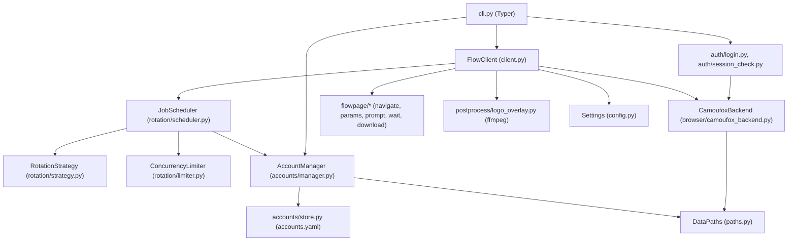
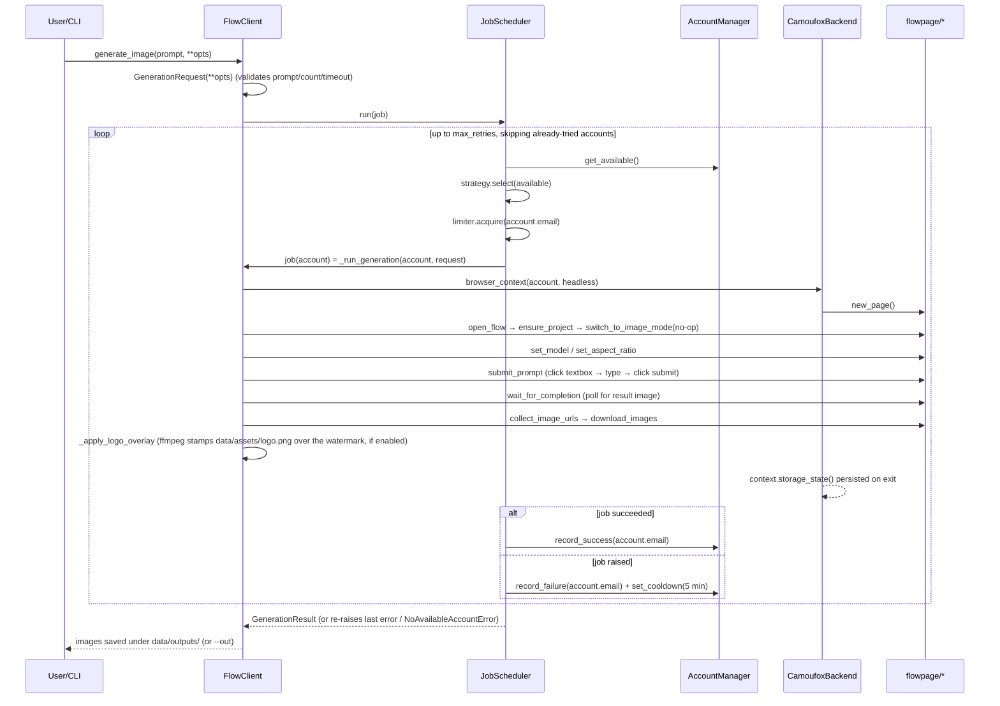
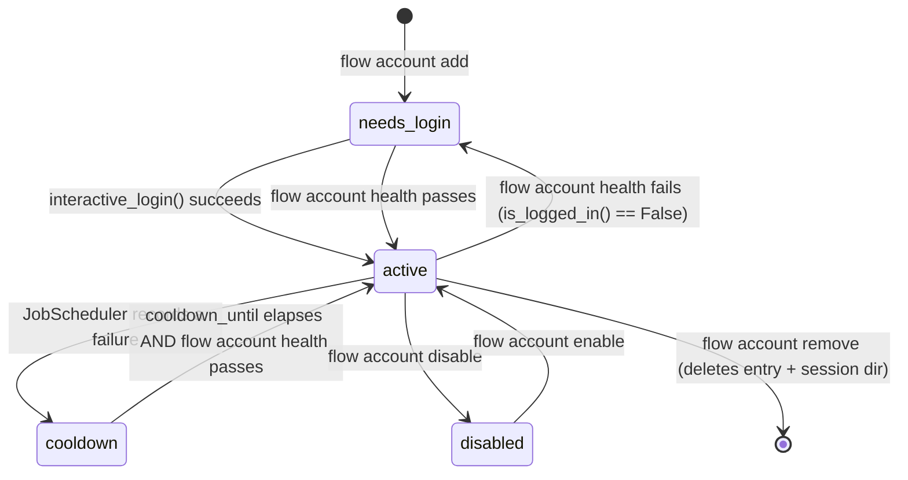

# Google Flow Wrapper — Architecture & Implementation

**Package:** `google_flow_wrapper` · **Version:** 0.1.0 · **Last updated:** 2026-08-14

This document describes how the codebase is actually built, as opposed to
[google-flow-wrapper-requirement.md](google-flow-wrapper-requirement.md) (what was asked for) and
[google-flow-wrapper-tasks.md](google-flow-wrapper-tasks.md) (task-by-task status/history). Read this
when you need to understand *how a piece works* or *where to change something*.

---

## 1. Layout

```
src/google_flow_wrapper/
├── __init__.py            # exports FlowClient, __version__
├── cli.py                 # Typer app: `flow ...`
├── client.py               # FlowClient — the public library API
├── config.py               # Settings (pydantic-settings: env > YAML > defaults)
├── paths.py                # DataPaths — resolves data/accounts.yaml, data/sessions/<email>/, data/outputs/
├── models.py                # Account, AccountStatus, GenerationRequest, GeneratedImage, GenerationResult
├── errors.py                 # FlowError hierarchy
├── logging_setup.py           # structlog configuration (not yet wired into business logic)
├── accounts/
│   ├── store.py                # atomic YAML load/save for accounts.yaml
│   └── manager.py               # AccountManager: CRUD, status, metrics, availability
├── browser/
│   ├── base.py                   # BrowserBackend protocol
│   ├── camoufox_backend.py        # CamoufoxBackend: launches Camoufox, persists storage_state.json
│   ├── session.py                  # account_browser() convenience wrapper
│   ├── proxy.py                     # validate_proxy_url()
│   ├── humanize.py                   # human_delay/human_type/human_mouse_jitter
│   └── doctor.py                      # camoufox_status() — used by `flow doctor`
├── auth/
│   ├── login.py                        # interactive_login(), relogin()
│   └── session_check.py                 # is_logged_in()
├── flowpage/
│   ├── selectors.py                       # ALL DOM selectors/URLs — single-file UI-change surface
│   ├── navigate.py                         # open_flow(), ensure_project(), switch_to_image_mode() (no-op)
│   ├── params.py                            # set_model(), set_aspect_ratio()
│   ├── prompt.py                             # submit_prompt() (+ reference-image upload)
│   ├── wait.py                                # wait_for_completion() + error classification
│   └── download.py                             # collect_image_urls(), download_images()
├── postprocess/
│   └── logo_overlay.py                          # overlay_logo_in_place() — stamps data/assets/logo.png over Flow's watermark via ffmpeg
└── rotation/
    ├── strategy.py                              # RoundRobinStrategy, LeastLoadedStrategy
    ├── limiter.py                                 # ConcurrencyLimiter (per-account + global semaphores)
    └── scheduler.py                                 # JobScheduler — ties strategy+limiter+retries together

tests/                        # 82 tests, one file per src module (mirrors the tree above)
```

---

## 2. Layered architecture



- **`cli.py`** is a thin Typer wrapper — every command constructs an `AccountManager` and/or
  `CamoufoxBackend`/`FlowClient` from the resolved `Settings` and delegates immediately.
- **`FlowClient`** (the library entrypoint) owns one `AccountManager`, one `CamoufoxBackend`, and one
  `JobScheduler`, constructed once per `FlowClient()` instance.
- **`JobScheduler`** is generic — it doesn't know anything about browsers or Flow. It takes an
  `async def job(account) -> T` callable, selects an account via the `RotationStrategy`, runs it
  under the `ConcurrencyLimiter`, and records success/failure on the `AccountManager`.
- **`flowpage/*`** functions are plain functions taking a Playwright `Page` — they have no
  knowledge of accounts, rotation, or settings. `FlowClient._run_generation` is the only place that
  wires a `Page` through the full navigate → params → prompt → wait → download sequence.

---

## 3. Request lifecycle (`flow generate` / `FlowClient.generate_image`)



**Retry semantics** (`rotation/scheduler.py`): each attempt picks a *different* available account
(tracked via a per-call `attempted` set), so a single `generate_image()` call never retries the
same account twice. If every account is exhausted or unavailable, the loop stops and re-raises the
last job exception (or `NoAvailableAccountError` if no account was ever available).

---

## 4. Account lifecycle



- `Account.is_available()` (models.py) is the single source of truth for whether an account can be
  selected: `status == active`, or `status == cooldown` **and** `cooldown_until` has passed.
- `flow account health` is the only command that can *promote* an account back to `active` from
  `needs_login`/`cooldown` — a fixed bug (see §7) used to only ever demote, never promote.
- **Known gap (task 9.4):** every job failure — whether a real auth problem, a quota error, or just
  a stale selector — currently triggers the *same* flat 5-minute cooldown via
  `JobScheduler.run`'s except-block. There is no error-type-specific handling yet (e.g. `AuthError`
  should probably set `needs_login` instead of `cooldown`).

---

## 5. Data & configuration

### 5.1 On-disk layout (`paths.py`)

```
<data_dir>/                  # default "data", overridable via --data-dir / FLOW_DATA_DIR
├── accounts.yaml            # AccountManager registry (atomic write: temp file + os.replace)
├── sessions/
│   └── <email>/
│       └── storage_state.json   # Playwright storage state (cookies + localStorage), written on
│                                  # every browser_context() exit, loaded on next launch
└── outputs/                  # default download location (override with --out or default_output_dir)
```

`_ensure_private_dir()` chmods each directory to owner-only (`0o700`) on POSIX; this is a
best-effort no-op on Windows (NTFS ACLs aren't touched).

### 5.2 Settings precedence (`config.py`)

```
init kwargs > FLOW_* env vars > YAML file at $FLOW_CONFIG_FILE > .env > pydantic defaults
```

Implemented via a custom `settings_customise_sources` — the YAML loader
(`_yaml_config_source`) is a plain closure wrapped in a `cast(...)` to satisfy `mypy --strict`
(pydantic-settings only requires the source be *callable*, not a `PydanticBaseSettingsSource`
instance, at runtime).

Fields: `data_dir`, `headless`, `per_account_concurrency`, `default_timeout_seconds`,
`max_retries`, `default_output_dir`.

### 5.3 Domain models (`models.py`)

| Model | Purpose |
|---|---|
| `Account` | email (normalized lowercase), label, proxy, `AccountStatus`, timestamps, success/fail counts, `cooldown_until` |
| `AccountStatus` (StrEnum) | `active` / `disabled` / `needs_login` / `cooldown` |
| `GenerationRequest` | prompt (non-empty), model, aspect_ratio, count (1-8), reference_images, timeout |
| `GeneratedImage` | url, local_path, content bytes |
| `GenerationResult` | request, account_email, images, duration_seconds |

---

## 6. Browser automation layer

- **`BrowserBackend`** (browser/base.py) is a `Protocol` with one method:
  `browser_context(account, *, headless) -> AbstractAsyncContextManager[BrowserContext]`. This is
  the seam that lets tests substitute a fake backend without touching Camoufox/Playwright.
- **`CamoufoxBackend`** (the only real implementation): launches a fresh Camoufox `Browser` per
  account (`humanize=True`; proxy + `geoip=True` if the account has one), then
  `browser.new_context(storage_state=...)` if a prior session exists. On exit, always persists
  `context.storage_state()` back to disk and closes the context — even if the caller's code raised.
- **`browser/proxy.py`**: validates `scheme://[user:pass@]host:port` (http/https/socks4/socks5)
  before it's ever handed to Camoufox; called from both `AccountManager.add()` and
  `build_launch_options()`.
- **`browser/humanize.py`**: `human_delay()` (randomized sleep), `human_type()` (per-character
  `press_sequentially` with randomized delay), `human_mouse_jitter()`. Used throughout `flowpage/*`.
- **`browser/doctor.py`**: `camoufox_status()` wraps `camoufox.pkgman.installed_verstr()` — powers
  `flow doctor`.

---

## 7. The Flow web app itself (`flowpage/`) — verified findings

This is the most important section for anyone touching selectors after a Flow UI change. All of
the following was reverse-engineered live against a real account on 2026-08-14 (see
[google-flow-wrapper-tasks.md](google-flow-wrapper-tasks.md) Phase 5 for the blow-by-blow history):

1. **The public marketing page (`labs.google/flow`) is not the app.** It loads with or without
   login and is useless as an auth signal. The real, OAuth-gated app is at
   **`https://labs.google/fx/tools/flow`** (redirects to a locale path like `/vi/tools/flow` once
   authenticated, or to `accounts.google.com` if not). `auth/session_check.py::is_logged_in` and
   `auth/login.py::interactive_login` both just check whether the final URL contains
   `accounts.google.com` (`LOGIN_REDIRECT_HOST`) — far more robust than any DOM check on this app.

2. **No `data-testid` or `aria-label` attributes exist anywhere**, and all visible text is
   localized to the account's language (this test account renders in Vietnamese). The only stable,
   locale-independent anchors are **Google's Material Symbols icon-ligature names**, rendered as
   plain text inside buttons (e.g. `add_2`, `arrow_forward`, `tune`). Every selector in
   `selectors.py` is built around `button:has-text('<ligature>')`.

3. **The prompt box is a Slate.js contenteditable `<div>`** (`[role="textbox"]`), not a
   `<textarea>`. Typing into it via `human_type()`'s per-character `press_sequentially` **without
   first explicitly `.click()`-ing it** updates the visible DOM text but never establishes Slate's
   internal selection/anchor state — the submit button stays `aria-disabled="true"` forever, with
   no error until a very long, generic Playwright click timeout. Fix (in `prompt.py`): always
   `.click()` the box to focus it before typing.

4. **`navigate.ensure_project()` must confirm success via the URL.** Clicking the "New project"
   button (`add_2`) and moving on without verifying we actually landed on a `/project/...` URL
   used to silently continue on failure, surfacing 30+ seconds later as an opaque "prompt textbox
   not found" error deep inside `submit_prompt`. It now explicitly `page.wait_for_url(...)`s for
   `/project/` and raises `SelectorNotFoundError` immediately if that never happens.

5. **There is no separate "image mode" tab.** Flow's default UI is already an agent-style prompt
   box that decides what to create from the prompt text; `navigate.switch_to_image_mode()` is kept
   only as a documented no-op so the call site in `client.py` doesn't need to change if a real mode
   switch is ever discovered.

6. **Generation parameters (model / aspect ratio / count)** live behind a "tune" (Settings) icon
   button, which opens a panel with aspect-ratio buttons ("16:9"/"4:3"/"1:1"/"3:4"/"9:16"), count
   buttons ("x1"–"x4"), and a model dropdown (seen: "Nano Banana 2"). `params.py` opens this panel
   and clicks the matching option — **verified that the panel opens; the option click itself has
   not been exercised live.**

7. **The completed image** is an `` whose `src` matches
   `/fx/api/trpc/media.getMediaUrlRedirect?name=<uuid>` — a stable backend path (its CSS classes
   are shared with the unrelated user-avatar image, so those alone aren't usable).
   `RESULT_IMAGE_THUMBNAIL = "img[src*='media.getMediaUrlRedirect']"`.
   - Each generated image appears **twice** in the DOM (main canvas + agent chat log) with the
     **same** `src` — `download.collect_image_urls` dedupes before slicing to the requested count.
   - The `src` is a **relative URL** — `download.download_images` resolves it against `page.url`
     via `urllib.parse.urljoin` before fetching through `page.context.request.get(...)`.

8. **Flow's "confirm before creating" setting** (seen in the settings panel, defaulting to
   "always confirm") did **not** show a dialog during the real, successful run — it may only apply
   to video generation, or differ by account tier. Not handled in code; revisit if a future run
   hangs right after clicking submit.

**End-to-end proof:** on 2026-08-14, `flow generate "a red apple on a wooden table" --count 1`
produced a real 143 KB PNG matching the prompt, downloaded to `data/outputs/`.

---

## 8. Rotation, concurrency, and retries

- **`RoundRobinStrategy`** (default): remembers the last-picked email and returns the next one in
  the *current* available list, falling back to the first element if the last pick is no longer
  present (e.g. it just got disabled). **`LeastLoadedStrategy`**: picks
  `min(success_count + fail_count)` — implemented but not wired up as the default anywhere.
- **`ConcurrencyLimiter`**: one `asyncio.Semaphore(per_account)` per account email (via
  `defaultdict`), plus an optional single global `asyncio.Semaphore` shared across all accounts.
- **`JobScheduler.run`**: the only orchestration logic. Loop bound is `max_retries` (default 3,
  from `Settings.max_retries`); each iteration re-fetches `get_available()` and filters out emails
  already attempted this call, so failing accounts can't be retried within the same
  `generate_image()` invocation. On any exception from `job(account)`: `record_failure` +
  `set_cooldown(5 min)`, then continue to the next available account.

---

## 9. CLI surface (`cli.py`)

| Command | Delegates to |
|---|---|
| `flow version` | — |
| `flow generate <prompt> [--model --aspect --count --out --timeout]` | `FlowClient.generate_image_sync` |
| `flow doctor` | `browser.doctor.camoufox_status()` |
| `flow config show` / `flow config path` | `Settings.model_dump_json()` / `Settings.paths.root` |
| `flow account add <email> [--label --proxy --login/--no-login --timeout]` | `AccountManager.add` + `auth.login.interactive_login` (unless `--no-login`) |
| `flow account remove <email>` | `AccountManager.remove` |
| `flow account list` | `AccountManager.list_accounts` |
| `flow account enable` / `disable <email>` | `AccountManager.enable` / `disable` |
| `flow account relogin <email> [--timeout]` | `auth.login.relogin` |
| `flow account health` | `auth.session_check.is_logged_in` per account; **promotes** `needs_login`/`cooldown` → `active` on success, **demotes** to `needs_login` on failure |

Global options `--config <file>` (sets `FLOW_CONFIG_FILE`) and `--data-dir <dir>` are handled in
the `@app.callback()` and stashed on `ctx.obj: Settings` for every subcommand.

---

## 10. Error hierarchy (`errors.py`)

```
FlowError
├── AccountAlreadyExistsError   # AccountManager.add() duplicate email
├── AccountNotFoundError        # AccountManager operations on unknown email
├── NoAvailableAccountError     # JobScheduler: no account ever available
├── AuthError                   # (defined, not yet raised anywhere — see gap below)
├── GenerationTimeoutError      # wait.py: no result within timeout, no error banner found
├── QuotaExceededError          # wait.py: error banner text contains "quota"/"credit"
└── SelectorNotFoundError       # navigate.py: couldn't confirm reaching a project
```

`wait.py::_classify_error` inspects the error-banner's text (if any) for `"quota"`/`"credit"` →
`QuotaExceededError`, or `"sign in"`/`"log in"`/`"session"` → `AuthError`, else falls back to
`GenerationTimeoutError`. **This path is untested against a real Flow error** — no error was
encountered during the live verification run.

---

## 11. Known gaps / next steps

These are tracked in detail in [google-flow-wrapper-tasks.md](google-flow-wrapper-tasks.md) Phase
9/10; summarized here for architecture context:

1. **Structured logging isn't wired in.** `logging_setup.py` (`configure_logging`/`get_logger`)
   works and is tested standalone, but nothing in `scheduler.py`, `client.py`, or `login.py` calls
   it — job/account/error events aren't currently logged anywhere.
2. **Error-type-agnostic account status transitions.** `JobScheduler` treats every failure
   identically (flat cooldown). It should route `AuthError` → `needs_login` and leave `cooldown`
   for transient/quota failures.
3. **Windows data-dir permissions.** `_ensure_private_dir`'s `os.chmod` is a POSIX-only
   best-effort; no equivalent ACL restriction is applied on Windows.
4. **No automated integration tests** against the live site (everything in `tests/` mocks
   Playwright/Camoufox). The Phase 5 verification above was done via one-off scripts, run
   manually, and deleted afterward — not part of the committed test suite.
5. **Unverified live:** reference-image upload (`prompt.attach_reference_images`), the
   aspect-ratio/model *option click* inside the settings panel (only the panel opening was
   verified), and the error-banner classification path in `wait.py`.
