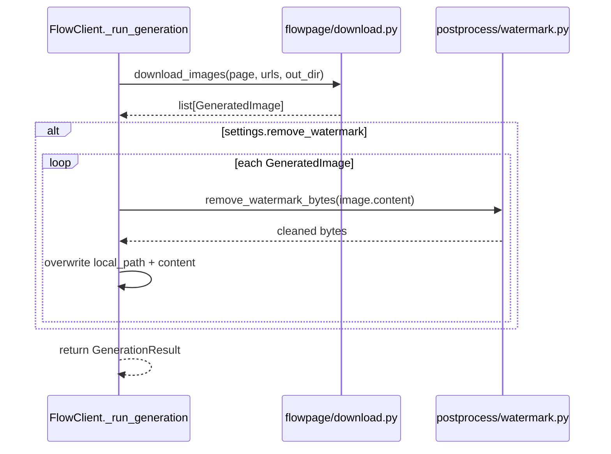

# Watermark Removal — Verification & Integration Task Plan

**Source script:** [VimalMollyn/Gemini-Watermark-Remover-Python](https://github.com/VimalMollyn/Gemini-Watermark-Remover-Python) (MIT license)
**Target:** `google_flow_wrapper` — add watermark stripping as the final step of the generation
pipeline, after images are downloaded (`flowpage/download.py` → `FlowClient._run_generation`).
**Status legend:** `TODO` · `IN PROGRESS` · `DONE` · `BLOCKED`
**Last updated:** 2026-08-14

> ⛔ **BLOCKED as of 2026-08-14 — Phase 0 failed.** The upstream algorithm was tested against a
> real Flow output image (`data/outputs/tuanle2x7@gmail.com-41444-0.png`, 1376×768) and does
> **not** cleanly remove Flow's watermark — see §4 Phase 0 for details and evidence. It produces a
> solid black artifact instead, both with the size bucket the script auto-selects (48px) and with
> the alternative bucket (96px). Phases 1–4 (vendoring/integration) are **not implemented** and are
> blocked pending further investigation (out of scope for now — see §5).
>
> ✅ **Superseded by Strategy 2 (implemented 2026-08-14) — see §6.** Instead of reverse-blending
> the watermark away, an opaque branding logo (`data/assets/logo.png`) is stamped over it with
> ffmpeg. This ships as the actual final step of the generation pipeline.

---

Gemini (and, presumably, Flow) burns a visible logo into the bottom-right corner of generated
images using plain alpha compositing:

```
watermarked = α × logo + (1 - α) × original
```

The tool inverts this exactly:

```
original = (watermarked - α × logo) / (1 - α)
```

`α` is not guessed — it's a **pre-computed per-pixel alpha map**, shipped as two small PNG assets
(`bg_48.png`, `bg_96.png`) captured from real watermark samples. Detection of *which* map to use is
purely dimension-based (no image analysis):

| Condition | Logo size | Margin |
|---|---|---|
| width > 1024 **and** height > 1024 | 96×96 | 64px |
| otherwise | 48×48 | 32px |

Public API (from the upstream script): `remove_watermark(image) -> PIL.Image` (accepts a path,
bytes, or `PIL.Image`), and `remove_watermark_bytes(image_bytes, output_format="PNG") -> bytes`.

**Stated limitations (from upstream README):** only removes the visible bottom-right logo, not
SynthID; best on lossless PNG (JPEG recompression can leave residual error).

---

## 2. Open risks — must resolve before writing integration code

1. **Unverified assumption: Flow's watermark == Gemini API's watermark.** This tool was built
   against images from the Gemini API/app. Flow is a different product surface; its watermark logo,
   position, size thresholds, or alpha values may differ even if visually similar. **This must be
   checked against a real Flow-downloaded PNG before any code is written** — if the alpha maps don't
   match, the reverse-blend will produce visible artifacts instead of a clean image (worse than doing
   nothing).
2. **License/attribution.** MIT license permits vendoring, but the copyright notice must be
   preserved (e.g. a `NOTICE`/`THIRD_PARTY_LICENSES.md` entry crediting VimalMollyn and the
   original `journey-ad/gemini-watermark-remover` JS project it's ported from).
3. **New dependency:** `numpy` is not currently in `pyproject.toml` (only `pillow` is). Needs adding.
4. **Policy note:** removing a provenance/watermark indicator is a product-policy grey area (not a
   security or legal issue for this local tool, but worth a one-line disclosure in the README so
   users know this step exists and can disable it).

Resolving risk #1 is **Phase 0** below and gates everything else — if it fails, this plan stops
there and reverts to "not currently feasible."

---

## 3. Proposed design (pending Phase 0 sign-off)

- **New subpackage:** `src/google_flow_wrapper/postprocess/`
  - `watermark.py` — vendored/adapted `remove_watermark()` / `remove_watermark_bytes()`
    (typed, `from __future__ import annotations`, no `print()` debug output — replace with
    `logging_setup.get_logger()` calls per existing convention).
  - `assets/bg_48.png`, `assets/bg_96.png` — copied verbatim from upstream (binary, do not modify).
- **Config (`config.py`):** `Settings.remove_watermark: bool = True` (`FLOW_REMOVE_WATERMARK` env
  var), so it's on by default but can be disabled globally or per-run.
- **CLI (`cli.py`):** `flow generate --no-watermark-removal` flag overriding the setting for one run.
- **Integration point (`client.py::_run_generation`):** after
  `download.download_images(...)` and before returning `GenerationResult`, if
  `settings.remove_watermark` is true, pass each `GeneratedImage` through the new module and
  overwrite both `local_path` (re-save PNG) and `content` (bytes) in place. Failures in this step
  must **not** fail the whole generation — catch and log, keep the original image, since a
  cosmetic post-process step failing shouldn't lose an otherwise-successful generation.
- **Models:** no schema change needed — `GeneratedImage.url/local_path/content` already fit.



---

## 4. Task list

### Phase 0 — Feasibility verification (gates everything else)

| # | Task | Status |
|---|------|--------|
| 0.1 | Download `gemini_watermark_remover.py`, `bg_48.png`, `bg_96.png` from upstream into a scratch/throwaway location (not committed yet). | DONE |
| 0.2 | Run the script unmodified against a real Flow-downloaded PNG already in `data/outputs/` (`tuanle2x7@gmail.com-41444-0.png`, 1376×768 — the "red apple" image from the 2026-08-14 live run, see [architecture.md §7](architecture.md#7-the-flow-web-app-itself-flowpage--verified-findings)). | DONE |
| 0.3 | Visually diff input vs. output (side-by-side crop of the bottom-right corner). Confirm the logo is fully removed with no ghosting/color banding. | DONE — **FAILED** |
| 0.4 | Crop region looked wrong → tried the alternative size bucket (96×96/64px margin, forced via monkey-patching `detect_watermark_config`) to see if the auto-detected 48px bucket was simply the wrong choice for this image's aspect ratio. | DONE — **also FAILED** |
| 0.5 | Decision gate: outcome is **FAIL**. Recalculating a Flow-specific alpha map is out of scope for now (see §5) — this plan is **shelved / blocked** until that investment is made. | DONE — **BLOCKED** |

**Acceptance:** a human has visually confirmed, on at least one real Flow output image per size
bucket (≤1024px and >1024px, if such an image is available), that the watermark disappears cleanly.
**Result: not met.** Evidence:

- **Auto-detected config (48×48 logo, 32px margin)** — the script reports "Pixels modified: 2027"
  (of 2304 in the 48×48 box), i.e. it believes it found and corrected a watermark. Visually, the
  original faint sparkle logo is still present in the output, **and** a new solid black
  sparkle-shaped artifact appears offset from it. This means the assumed watermark position and/or
  the alpha values for the 48px map do not match what Flow actually renders.
- **Forced 96×96/64px config** — same experiment with the larger bucket: an even larger, solid
  black artifact appears, and a residual (still not fully removed) lighter watermark shape remains
  visible next to it. Strictly worse.
- **Conclusion:** Flow's visible watermark differs from the Gemini-API watermark this tool was
  calibrated against (different position and/or different alpha map, and/or the size-bucket rule
  itself — `width>1024 AND height>1024` — doesn't match Flow's actual rule for wide-but-short
  images like 1376×768). Applying this tool as-is to Flow output makes images **worse**, not
  cleaner, so it must not ship.

### Phase 1 — Vendor the algorithm

| # | Task | Status |
|---|------|--------|
| 1.1 | Add `numpy` to `pyproject.toml` `dependencies`. | TODO |
| 1.2 | Create `src/google_flow_wrapper/postprocess/__init__.py` and `watermark.py`, porting `detect_watermark_config`, `load_alpha_map`/`get_alpha_map` (cached), `remove_watermark`, `remove_watermark_bytes`. Add full type hints (`mypy --strict` must pass) and drop the CLI `main()`/`sys.argv` bits (not needed here). | TODO |
| 1.3 | Copy `bg_48.png`/`bg_96.png` into `src/google_flow_wrapper/postprocess/assets/`; ensure they're included in the wheel (`[tool.hatch.build.targets.wheel]` package-data, or confirm hatchling includes non-`.py` files under `packages` by default — verify with a built wheel listing). | TODO |
| 1.4 | Add `THIRD_PARTY_LICENSES.md` (or a section in `README.md`) crediting the MIT-licensed source and its own upstream (`journey-ad/gemini-watermark-remover`). | TODO |

**Acceptance:** `from google_flow_wrapper.postprocess.watermark import remove_watermark_bytes` works
in a clean venv install; `mypy --strict` and `ruff check` clean.

### Phase 2 — Unit tests for the vendored module

| # | Task | Status |
|---|------|--------|
| 2.1 | `tests/test_postprocess_watermark.py`: `detect_watermark_config` boundary cases (1024×1024 exactly, 1025×1025, 1024×2000, 2000×2000). | TODO |
| 2.2 | Synthetic round-trip test: take a small solid-color test image, forward-composite the known alpha map onto it in the test itself (`watermarked = α·255 + (1-α)·original`) to build a fixture, then assert `remove_watermark` recovers the original within a small tolerance (8-bit rounding). This avoids depending on a real Flow screenshot for correctness testing. | TODO |
| 2.3 | Edge case: image smaller than the watermark box (e.g. 40×40) → function returns the image unchanged, no exception. | TODO |
| 2.4 | `remove_watermark_bytes` round-trips PNG and JPEG (`output_format="JPEG"`, `quality=95`) without raising. | TODO |
| 2.5 | Non-PIL/path/bytes input raises a clear error (mirrors upstream `ValueError`). | TODO |

**Acceptance:** new tests pass in isolation (`pytest tests/test_postprocess_watermark.py -v`);
no dependency on network or real Flow images.

### Phase 3 — Pipeline integration

| # | Task | Status |
|---|------|--------|
| 3.1 | `config.py`: add `remove_watermark: bool = True` field. | TODO |
| 3.2 | `client.py::_run_generation`: after `download.download_images`, iterate images and call the new module when `settings.remove_watermark`; overwrite `content`/re-save `local_path`; wrap in try/except that logs and keeps the original image on failure (does not fail the generation). | TODO |
| 3.3 | `cli.py::generate`: add `--no-watermark-removal` flag → sets `settings.remove_watermark = False` for that invocation only. | TODO |
| 3.4 | Update `tests/test_client.py` to cover: watermark removal invoked by default, skipped when disabled, and failure-is-swallowed-and-logged behavior (mock the postprocess call). | TODO |
| 3.5 | Update `tests/test_cli.py` for the new flag. | TODO |

**Acceptance:** `pytest` still green (full suite); `flow generate ... ` (no flag) produces
watermark-stripped output; `flow generate ... --no-watermark-removal` produces the original,
unmodified download.

### Phase 4 — Live verification (mirrors the Phase 5 live-run precedent in `architecture.md`)

| # | Task | Status |
|---|------|--------|
| 4.1 | Run `flow generate "<test prompt>" --count 1` against a real account with watermark removal enabled (default). | TODO |
| 4.2 | Visually inspect the saved output — confirm no visible logo in the bottom-right corner and no new artifacts elsewhere in the image. | TODO |
| 4.3 | Re-run once with `--no-watermark-removal` and diff file sizes/hashes against the Phase 4.1 output to confirm the flag actually short-circuits the step. | TODO |
| 4.4 | Document the outcome (pass/fail, example before/after) in `architecture.md` §7 or a new short addendum, same as the existing "End-to-end proof" note. | TODO |

**Acceptance:** one real, human-inspected before/after pair confirming the feature works against a
live Flow-generated image, plus a recorded fallback path (flag) if it ever needs to be disabled.

---

## 5. Out of scope (for this plan)

- Removing SynthID or any invisible/embedded watermark — upstream explicitly does not do this, and
  it's a fundamentally different (non-visual) mechanism.
- Recomputing a Flow-specific alpha map from scratch if Phase 0 fails — that would require
  capturing multiple raw watermark samples and is a separate, larger effort only worth doing if
  Phase 0 shows the current maps are close but not exact.
- Batch/video post-processing — this plan only covers the still-image generation path already in
  `client.py`.

---

## 6. Strategy 2 (implemented) — cover the watermark with ffmpeg instead of removing it

Since reverse-alpha-blend removal (Phases 1–4 above) doesn't work against Flow's actual watermark,
a different, much simpler strategy was implemented instead: **stamp an opaque branding logo over
the watermark's position**, using `ffmpeg` (already installed on the dev machine; no new Python
dependency). This doesn't attempt to reconstruct the original pixels — it just visually occludes
the watermark with the project's own logo.

### 6.1 Measured geometry

A human visually measured the watermark's bounding box on the same real 1376×768 sample image used
in Phase 0: bottom-right corner, roughly **(1280, 638)** to **(1355, 712)** — i.e. **21px from the
right edge**, **56px from the bottom edge**, occupying a **75×74px** box. This was verified to line
up exactly with the visible watermark (see §6.3).

### 6.2 Implementation

- **`src/google_flow_wrapper/postprocess/logo_overlay.py`** — `overlay_logo(image_path, logo_path,
  output_path)` shells out to `ffmpeg` with a single filter graph:
  `[1:v]scale=75:74[wm];[0:v][wm]overlay=W-w-21:H-h-56`, where `W/H` are the main image's own
  dimensions and `w/h` are the scaled logo's dimensions (ffmpeg's built-in overlay aliases) — so
  the position is computed relative to each image's actual size, not hardcoded to 1376×768.
  `overlay_logo_in_place(image_path, logo_path)` writes to a `<name>.tmp` staging file and
  `Path.replace()`s the original, so it's safe to use the same path as both input and output.
  `ffmpeg_available()` checks `shutil.which("ffmpeg")` up front.
- **`config.py`**: `Settings.overlay_logo: bool = True` (`FLOW_OVERLAY_LOGO` env var) and
  `Settings.logo_path: str | None = None` (defaults to `<data_dir>/assets/logo.png` via the new
  `DataPaths.assets_dir` property).
- **`client.py::_run_generation`**: after `download.download_images`, calls the new
  `_apply_logo_overlay()` helper, which skips silently if disabled or the logo file is missing, and
  catches `LogoOverlayError` per-image so a cosmetic overlay failure never fails the whole
  generation.
- **`cli.py::generate`**: `--no-logo-overlay` flag disables it for a single run.
- **Tests:** `tests/test_postprocess_logo_overlay.py` (ffmpeg command construction/failure handling
  via mocked `subprocess.run`, in-place replace logic), plus coverage in `tests/test_client.py`
  (disabled / missing-logo / success / swallowed-error paths) and `tests/test_cli.py` (the new
  flag). Full suite: 92 tests passing, `ruff check` and `mypy --strict` clean.

### 6.3 Verification against the real sample

Ran the actual integrated `FlowClient._apply_logo_overlay` (real `ffmpeg`, real
`data/assets/logo.png`) against a copy of `data/outputs/tuanle2x7@gmail.com-41444-0.png` and
visually confirmed the logo lands exactly over the watermark's bounding box with no part of the
original watermark visible outside the logo's edges. One implementation bug was caught and fixed
during this check: the `.tmp` staging file's compound extension (`.png.tmp`) made ffmpeg unable to
infer an output muxer — fixed by passing `-f image2` explicitly.

**Not yet done:** a live end-to-end run through `flow generate` against a real account (this was
verified by calling `_apply_logo_overlay` directly against a previously-downloaded sample, not via
a fresh live generation). Recommended before considering this fully proven in production.

