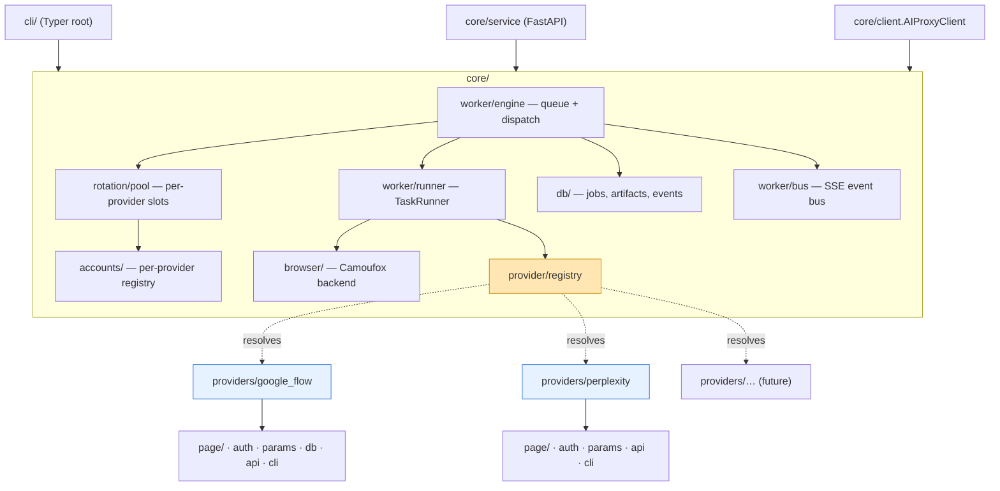
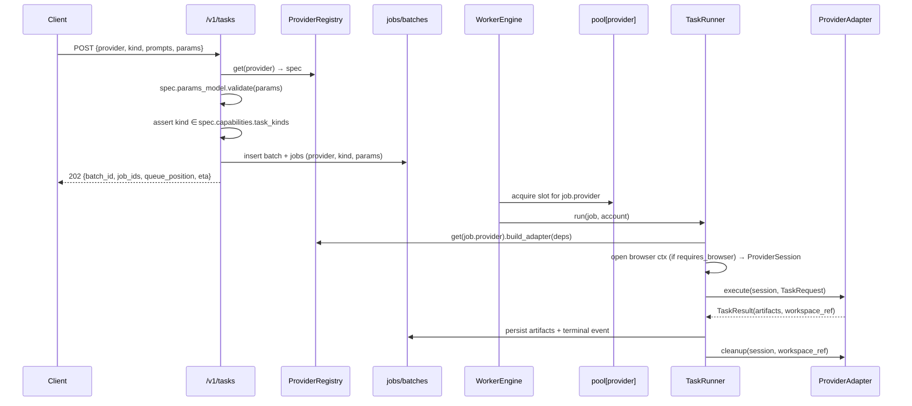

# AI Proxy — Multi-Provider Refactor Plan

**Supersedes (structurally):** [google-flow-wrapper-module/architecture.md](../google-flow-wrapper-module/architecture.md) · [add-rest-api-service/rest-api-service-plan.md](../add-rest-api-service/rest-api-service-plan.md)
**Version:** 0.1 (plan)
**Last updated:** 2026-08-16

Status legend: `TODO` · `IN PROGRESS` · `DONE` · `DONE (unverified)` · `BLOCKED` · `DEFERRED`

Tasks are ordered so that each one is independently implementable and testable, and each
depends only on tasks above it. Phases 1–8 are a pure refactor: **no new user-visible capability**
is added until Phase 9.

> **Scope decisions (confirmed 2026-08-16):**
> - Import root renamed `google_flow_wrapper` → **`ai_proxy`** (one breaking move).
> - First non-Flow provider: **Perplexity** (browser-automated).
> - Artifacts generalized beyond images to **text / image / video / file**.
> - **No backward compatibility** is preserved — pre-1.0, migrate in a single pass.

---

## 1. Analysis — What We Have

### 1.1 Reusability audit

Derived from a full pass over `src/google_flow_wrapper/` (~4,500 LOC).

| Area | Current location | Verdict | Destination |
|------|------------------|---------|-------------|
| Browser backend + `BrowserBackend` Protocol | `browser/` | Generic (good seam already) | `core/browser/` |
| Humanization, proxy validation, doctor | `browser/` | Generic | `core/browser/` |
| Account model, YAML store, `AccountManager` | `accounts/` | Generic, but **globally scoped** (no provider dimension) | `core/accounts/` + provider scoping |
| Rotation strategy / limiter / slot pool | `rotation/` | Generic | `core/rotation/` |
| SQLite engine + transaction ctx | `db/engine.py` | Generic | `core/db/` |
| Migration runner | `db/migrations.py` | Generic mechanism, **single linear version counter** | `core/db/migrations.py` + namespacing |
| `jobs`, `batches`, `job_events` tables | `db/` | ~80% generic; leaks `project_id`, `model`, `aspect_ratio`, `overlay_logo` | `core/db/` + `params` JSON |
| `images` table + repo | `db/images_repo.py` | Image-only | generalize → `artifacts` |
| `orphan_projects` table + repo | `db/orphan_projects_repo.py` | **Flow-only** | `providers/google_flow/db/` |
| Event bus (persist + fan-out) | `worker/bus.py` | Generic | `core/worker/bus.py` |
| Job queue, dispatch loop, worker tasks | `worker/engine.py` | Generic control flow, hard-wired to `GenerationRunner` | `core/worker/engine.py` + injected adapter |
| Orphan-running recovery | `worker/recovery.py` | Generic pattern, Flow-specific cleanup payload | split: core requeue + provider cleanup hook |
| `GenerationRunner.run()` page sequence | `worker/runner.py` | **Flow-only body**, generic skeleton | `core/worker/runner.py` (skeleton) + `providers/google_flow/adapter.py` |
| `classify_failure()` | `worker/runner.py` | Generic default table, provider-specific mapping | core default + adapter override |
| Image metadata extraction | `worker/metadata.py` | Generic | `core/worker/metadata.py` |
| FastAPI app, container, deps, errors, ETA, storage, serializers | `service/` | ~85% generic | `core/service/` |
| `jobs` / `batches` / `events` / `ops` routers | `service/routers/` | Generic | `core/service/routers/` |
| `generations` router | `service/routers/generations.py` | Image-shaped, Flow-shaped params | generalize → `tasks` router |
| `images` router | `service/routers/images.py` | Image-only | generalize → `artifacts` router |
| Login / session check | `auth/` | **Flow-only** (`labs.google` URL, `accounts.google.com` redirect probe) | `providers/google_flow/auth.py` |
| `flowpage/*` (selectors, navigate, params, prompt, wait, download) | `flowpage/` | **Flow-only** | `providers/google_flow/page/` |
| Logo overlay (watermark stamp) | `postprocess/logo_overlay.py` | **Flow-only** (measured watermark position) | `providers/google_flow/postprocess/` |
| CLI | `cli.py` | 70% generic shell, 30% Flow options | `cli/` + provider-mounted subcommands |
| Config | `config.py` | Generic core + Flow keys (`overlay_logo`, `delete_project_after_job`) | `core/config.py` + `providers/*/config.py` |

**Bottom line:** ~65% of the code is already provider-agnostic and moves with a rename. The real
work is (a) inventing the provider seam, (b) de-imaging the data model, (c) making accounts,
pools, migrations and routes **provider-scoped** rather than global.

### 1.2 Blockers found

| # | Blocker | Impact | Resolution phase |
|---|---------|--------|------------------|
| 1.2.1 | `AccountManager` has no provider dimension — one `accounts.yaml`, one `status`/`cooldown_until` per email | A Google quota cooldown would disable the same email's Perplexity capacity | Phase 3 (per-provider registry) |
| 1.2.2 | `storage_state.json` is stored per-email only (`data/sessions/<email>/`) | Two providers would overwrite each other's cookies | Phase 3 (path scoping) |
| 1.2.3 | Single global `schema_version` integer | A provider adding tables would collide with core migrations | Phase 4 (namespaced components) |
| 1.2.4 | `ServiceContainer` hard-wires `CamoufoxBackend`, `GenerationRunner`, `OrphanProjectsRepo` | Cannot host a second provider, or a non-browser provider | Phase 6/7 (registry-driven wiring) |
| 1.2.5 | `GenerationRequest.model` / `.aspect_ratio` / `.reuse_latest_project` are typed columns, and `ALLOWED_ASPECT_RATIOS` is a frozen set in `service/schemas.py` | Every new provider param would need a schema + DB migration | Phase 3/4 (`params` JSON + per-provider param model) |
| 1.2.6 | `GenerationResult.project_id` + `jobs.project_id` assume a "project per generation" lifecycle | Perplexity has threads, an HTTP provider has nothing | Phase 3 (`workspace_ref`, nullable, opaque) |
| 1.2.7 | `GeneratedImage` carries `url`/`local_path`/`content` only | Text/video/file outputs have no home | Phase 3 (`Artifact`) |
| 1.2.8 | `AccountSlotPool` enforces a single `max_concurrent_browsers` cap | Providers need independent per-provider caps plus one machine-wide cap | Phase 6 |
| 1.2.9 | Env prefix `FLOW_`, DB file `flow.db`, console scripts `flow` / `flow-api` | Misleading once multi-provider | Phase 1 |

---

## 2. Target Architecture

### 2.1 Design principles

1. **Core owns the machinery, providers own the site.** Core runs the queue, accounts, browser
   lifecycle, DB, events and HTTP surface. A provider only knows how to *drive one destination*.
2. **A provider is a plugin, not a branch.** No `if provider == "google_flow"` anywhere in `core/`.
   Providers self-describe through a `ProviderSpec` and self-register into a registry.
3. **Providers may bring their own modules.** A provider package may contain its own `db/`
   (migrations + repos), `api.py` (router), `cli.py` (subcommands), `config.py` (settings),
   `page/`, `postprocess/`. Core mounts them; core never imports them.
4. **Everything provider-specific that must be persisted goes in an opaque JSON blob**
   (`jobs.params`, `jobs.provider_state`) — never a new core column.
5. **Provider-agnostic first.** If a piece of logic could serve two providers, it belongs in `core/`.

### 2.2 Target package layout

```
src/ai_proxy/
├── __init__.py                    # version + `AIProxyClient` facade re-export
├── cli/
│   ├── __init__.py
│   ├── main.py                    # Typer root app; mounts provider sub-apps from registry
│   ├── run_cmd.py                 # `aip run --provider ...`
│   ├── accounts_cmd.py            # `aip accounts --provider ...`
│   ├── providers_cmd.py           # `aip providers list|show`
│   └── ops_cmd.py                 # `aip doctor|config|serve`
├── core/
│   ├── __init__.py
│   ├── config.py                  # CoreSettings (AI_PROXY_*) + provider settings resolution
│   ├── errors.py                  # AIProxyError hierarchy (auth/quota/timeout/selector/...)
│   ├── ids.py
│   ├── logging_setup.py
│   ├── paths.py                   # DataPaths, provider-scoped accessors
│   ├── models.py                  # Account, TaskKind, TaskRequest, Artifact, TaskResult, statuses
│   ├── client.py                  # AIProxyClient (library facade, provider-parametrized)
│   ├── accounts/                  # manager.py, store.py  (per-provider registries)
│   ├── browser/                   # base.py (Protocol), camoufox_backend.py, humanize.py,
│   │                              # proxy.py, session.py, doctor.py
│   ├── db/
│   │   ├── engine.py
│   │   ├── migrations.py          # component-namespaced migration runner
│   │   ├── schema.py              # core migration list
│   │   ├── jobs_repo.py
│   │   ├── artifacts_repo.py      # was images_repo
│   │   └── events_repo.py
│   ├── rotation/                  # strategy.py, limiter.py, pool.py, scheduler.py
│   ├── worker/
│   │   ├── bus.py
│   │   ├── engine.py              # dispatch loop, provider-agnostic
│   │   ├── runner.py              # TaskRunner: session lifecycle + adapter invocation
│   │   ├── failure.py             # default classify_failure table
│   │   ├── metadata.py
│   │   └── recovery.py
│   ├── postprocess/
│   │   ├── base.py                # PostProcessor Protocol
│   │   └── image_ops.py           # thumbnails, ffmpeg helpers (generic)
│   ├── service/
│   │   ├── app.py                 # app factory; mounts provider routers
│   │   ├── container.py           # ProviderRuntime map instead of single runner
│   │   ├── deps.py, errors.py, eta.py, storage.py, serializers.py, schemas.py
│   │   └── routers/
│   │       ├── tasks.py           # was generations.py
│   │       ├── jobs.py
│   │       ├── events.py
│   │       ├── artifacts.py       # was images.py
│   │       ├── providers.py       # NEW: capability discovery
│   │       └── ops.py
│   └── provider/                  # ◄── THE SEAM
│       ├── spec.py                # ProviderSpec, Capabilities, TaskKind support matrix
│       ├── adapter.py             # ProviderAdapter Protocol
│       ├── auth.py                # AuthHandler Protocol
│       ├── session.py             # ProviderSession (page/http client + emit + paths)
│       ├── params.py              # ProviderParams base model + JSON-schema export
│       └── registry.py            # register/get/list + entry-point discovery
└── providers/
    ├── __init__.py                # imports built-ins so they self-register
    ├── google_flow/
    │   ├── __init__.py            # SPEC = ProviderSpec(...); registers on import
    │   ├── adapter.py             # ex-GenerationRunner body
    │   ├── auth.py                # ex-auth/login.py + session_check.py
    │   ├── config.py              # GoogleFlowSettings (AI_PROXY_GOOGLE_FLOW_*)
    │   ├── params.py              # GoogleFlowParams: model, aspect_ratio, overlay_logo, ...
    │   ├── errors.py              # site-specific error → core error mapping
    │   ├── cli.py                 # `aip google-flow projects prune`, etc.
    │   ├── api.py                 # /v1/providers/google_flow/... router
    │   ├── db/
    │   │   ├── schema.py          # component="google_flow" migrations (orphan_projects)
    │   │   └── orphan_projects_repo.py
    │   ├── page/                  # ex-flowpage: selectors, navigate, params, prompt, wait, download
    │   └── postprocess/
    │       └── logo_overlay.py
    └── perplexity/
        ├── __init__.py            # SPEC
        ├── adapter.py
        ├── auth.py
        ├── config.py
        ├── params.py              # focus mode, model, sources, ...
        ├── errors.py
        ├── cli.py
        ├── api.py
        ├── db/                    # (only if it needs its own tables)
        └── page/                  # selectors, navigate, prompt, wait, extract
```

### 2.3 Layered view



**Dependency rule (enforced by an import-linter check, Task 10.3):**
`core/` must never import `ai_proxy.providers.*`. `providers/*` may import `core/` freely.
Sibling providers must never import each other.

### 2.4 The provider seam

#### 2.4.1 `ProviderSpec` — declarative registration

```python
# core/provider/spec.py
@dataclass(frozen=True)
class Capabilities:
    task_kinds: frozenset[TaskKind]          # {IMAGE}, {TEXT}, {TEXT, FILE}, ...
    max_outputs_per_request: int             # Flow: 4, Perplexity: 1
    supports_reference_inputs: bool
    supports_workspace_reuse: bool           # Flow projects / Perplexity threads
    requires_browser: bool                   # False ⇒ HTTP runtime, no Camoufox

@dataclass(frozen=True)
class ProviderSpec:
    name: str                                # "google_flow" — stable key in DB + API
    display_name: str
    capabilities: Capabilities
    params_model: type[ProviderParams]       # pydantic model → JSON Schema for /v1/providers
    settings_model: type[ProviderSettings]
    build_adapter: Callable[[ProviderRuntimeDeps], ProviderAdapter]
    build_auth: Callable[[ProviderRuntimeDeps], AuthHandler]
    migrations: Sequence[Migration] = ()     # applied under component=name
    api_router: APIRouter | None = None      # mounted at /v1/providers/{name}
    cli_app: typer.Typer | None = None       # mounted at `aip {name-with-dashes}`
```

#### 2.4.2 `ProviderAdapter` — the one method that matters

```python
# core/provider/adapter.py
class ProviderAdapter(Protocol):
    async def execute(self, session: ProviderSession, request: TaskRequest) -> TaskResult: ...
    def classify_failure(self, exc: BaseException) -> FailurePolicy | None: ...   # None ⇒ core default
    async def health_check(self, session: ProviderSession) -> bool: ...
    async def cleanup(self, session: ProviderSession, ref: WorkspaceRef) -> None: ...
```

Core's `TaskRunner` owns everything around it — acquiring the account slot, opening/closing the
browser context, timing, artifact persistence, event emission, retry accounting. The adapter is
handed a live `ProviderSession` and returns artifacts. This keeps the existing
`GenerationRunner` skeleton but moves the Flow body behind the interface.

```python
# core/provider/session.py
@dataclass
class ProviderSession:
    account: Account
    page: Page | None            # set when spec.capabilities.requires_browser
    http: httpx.AsyncClient | None
    paths: DataPaths
    output_dir: Path
    settings: ProviderSettings
    emit: Callable[[str, dict], Awaitable[None]]   # progress events → EventBus
    on_workspace_created: Callable[[str], Awaitable[None]]
```

#### 2.4.3 Registry

```python
# core/provider/registry.py
def register(spec: ProviderSpec) -> None: ...
def get(name: str) -> ProviderSpec: ...        # raises UnknownProviderError
def names() -> list[str]: ...
def discover() -> None:                        # built-ins + entry_points("ai_proxy.providers")
```

Third-party providers ship as separate distributions exposing an `ai_proxy.providers` entry point;
built-ins are eagerly imported by `providers/__init__.py`.

### 2.5 Generalized domain model

```python
class TaskKind(StrEnum):
    IMAGE = "image"; TEXT = "text"; VIDEO = "video"; FILE = "file"

class TaskRequest(BaseModel):
    provider: str
    kind: TaskKind
    prompt: str
    inputs: list[Path] = []                  # was reference_images
    count: int = 1
    timeout: float = 180.0
    params: dict[str, Any] = {}              # validated by spec.params_model
    workspace_ref: str | None = None         # reuse an existing project/thread

class Artifact(BaseModel):
    kind: TaskKind
    mime: str
    rel_path: Path | None = None             # image/video/file
    text: str | None = None                  # text answers stored inline
    source_url: str | None = None
    sha256: str | None = None
    width: int | None = None                 # image/video only
    height: int | None = None
    bytes: int | None = None
    meta: dict[str, Any] = {}                # citations, seeds, model echo, ...

class TaskResult(BaseModel):
    request: TaskRequest
    account_email: str
    artifacts: list[Artifact] = []
    duration_seconds: float = 0.0
    workspace_ref: str | None = None         # was project_id
    provider_state: dict[str, Any] = {}
```

Flow's `model` / `aspect_ratio` / `overlay_logo` / `reuse_latest_project` become fields of
`GoogleFlowParams`; Perplexity's `focus` / `search_mode` become fields of `PerplexityParams`.
Neither ever touches core.

### 2.6 Provider-scoped state on disk

```
data/
├── ai-proxy.db                       # renamed from flow.db
├── api_key
├── assets/
├── providers/
│   ├── google_flow/
│   │   ├── accounts.yaml             # per-provider account registry (blocker 1.2.1)
│   │   └── sessions/<email>/storage_state.json      (blocker 1.2.2)
│   └── perplexity/
│       ├── accounts.yaml
│       └── sessions/<email>/storage_state.json
├── outputs/<YYYY-MM-DD>/job_<id>/…   # unchanged, provider-agnostic
└── thumbnails/
```

Rationale: the same human may use `a@gmail.com` on both sites, but the *status*, *cooldown*, and
*cookies* are per-site facts. Making the registry per-provider avoids a whole class of
cross-provider quota bugs and keeps `AccountManager` untouched apart from its root path.

### 2.7 Database schema (core v3)

| Table | Component | Change |
|-------|-----------|--------|
| `schema_version` | core | `(component TEXT PRIMARY KEY, version INTEGER)` — was a single row |
| `batches` | core | + `provider TEXT NOT NULL` |
| `jobs` | core | + `provider TEXT NOT NULL`, + `kind TEXT NOT NULL`, + `params TEXT` (JSON), + `provider_state TEXT` (JSON); `project_id` → `workspace_ref`; **drop** `model`, `aspect_ratio`, `overlay_logo` (folded into `params`) |
| `artifacts` | core | renames `images`; + `kind`, + `mime`, + `text_content`, + `meta` (JSON); `width`/`height`/`bytes` become nullable |
| `job_events` | core | unchanged |
| `gf_orphan_projects` | google_flow | moved out of core, applied by the provider's migration list |

New index: `jobs(provider, status, priority DESC, queued_at)` so the dispatch loop can pull
per-provider work without a full scan.

**Migration strategy:** this is a dev-stage DB with local-only data. Core migration `v3` performs
an in-place `ALTER`/backfill (`provider='google_flow'`, `kind='image'`, `params` rebuilt from the
dropped columns) rather than a wipe, so existing `data/ai-proxy.db` rows survive. A
`--fresh-db` escape hatch is documented for anyone who prefers a clean start.

### 2.8 REST surface (v1, rewritten)

| Method | Path | Notes |
|--------|------|-------|
| `GET` | `/v1/providers` | list registered providers + capabilities |
| `GET` | `/v1/providers/{name}` | capabilities + JSON Schema of `params_model` |
| `POST` | `/v1/tasks` | replaces `POST /v1/generations`; body carries `provider`, `kind`, `prompts[]`, `count`, `params{}` |
| `GET` | `/v1/jobs`, `/v1/jobs/running`, `/v1/jobs/{id}` | + `provider` filter, `artifacts` inline |
| `POST` | `/v1/jobs/{id}/cancel` | unchanged |
| `GET` | `/v1/batches/{id}`, `POST /v1/batches/{id}/cancel` | unchanged |
| `GET` | `/v1/events` | + `provider` filter |
| `GET` | `/v1/artifacts`, `/v1/artifacts/{id}`, `/v1/artifacts/{id}/file`, `/v1/artifacts/{id}/thumbnail` | replaces `/v1/images*`; thumbnail 404s for non-visual kinds |
| `GET` | `/v1/accounts?provider=` | provider-scoped |
| `GET` | `/v1/stats?provider=` | per-provider queue depth / slots / ETA |
| `*` | `/v1/providers/{name}/…` | provider-supplied router (e.g. `google_flow/projects`) |
| `GET` | `/healthz`, `/readyz` | unchanged |

### 2.9 CLI surface

```
aip providers list|show <name>
aip run --provider google_flow "a red apple" --count 2 -p aspect_ratio=16:9 -p overlay_logo=false
aip run --provider perplexity  "summarize X" --kind text
aip run-batch --provider … --prompts-file p.txt
aip accounts --provider google_flow add|remove|list|enable|disable|health|login
aip config show | aip doctor | aip serve
aip google-flow projects prune          # provider-mounted subcommand
aip perplexity threads list
```

`-p key=value` pairs are validated against the provider's `params_model` before submission, so an
unknown or malformed param fails fast at the CLI instead of mid-job.

### 2.10 Request lifecycle (multi-provider)



---

## 3. Progress Summary

| Phase | Tasks | Done |
|-------|-------|------|
| 0. Decisions & Guardrails | 4 | 2 |
| 1. Rename & Core Extraction | 6 | 6 |
| 2. Provider Seam | 7 | 7 |
| 3. Domain Model Generalization | 6 | 6 |
| 4. Database Generalization | 7 | 7 |
| 5. Extract `google_flow` Provider | 9 | 9 |
| 6. Multi-Provider Worker & Rotation | 6 | 6 |
| 7. Provider-Aware Service Layer | 8 | 8 |
| 8. CLI Restructure | 5 | 5 |
| 9. Perplexity Provider | 8 | 0 |
| 10. Hardening, Docs & Release | 6 | 6 |
| **Total** | **72** | **62** |

---

## Phase 0 — Decisions & Guardrails

| # | Task | Rationale | Status |
|---|------|-----------|--------|
| 0.1 | Record an ADR in `docs/multi-provider-refactor/adr-001-provider-seam.md`: adapter-over-inheritance, per-provider account registries, opaque `params` JSON, no core→provider imports | Freeze §2.1 decisions before code moves | DONE |
| 0.2 | Add `import-linter` (or a `pytest` guard) contract: `ai_proxy.core` must not import `ai_proxy.providers.*`; providers must not import siblings | Mechanically enforces the seam from day one | DONE |
| 0.3 | Snapshot current behaviour: run the full suite + `scripts/e2e_service_test.py` against a live account and record the baseline (job duration, image count, endpoints exercised) in this doc | Refactor safety net — we must land back on this behaviour | BLOCKED |
| 0.4 | Create a `refactor/multi-provider` branch and tag `v0.2.0` on `main` as the pre-refactor restore point | Pre-1.0 hard break needs an escape hatch | TODO |

**Acceptance:** ADR merged; the import contract fails loudly if `core/` imports a provider; baseline
run recorded with timestamps.

---

## Phase 1 — Rename & Core Extraction (mechanical, no behaviour change)

| # | Task | Rationale | Status |
|---|------|-----------|--------|
| 1.1 | `pyproject.toml`: name `ai-proxy`, version `0.3.0.dev0`, console scripts `aip` → `ai_proxy.cli.main:app` and `ai-proxy-api` → `ai_proxy.core.service.app:run`; add optional extras `[google-flow]`, `[perplexity]`, `[dev]` | Blocker 1.2.9 | DONE |
| 1.2 | Rename package dir `src/google_flow_wrapper/` → `src/ai_proxy/`; update every import (`ruff --fix` + explicit sweep); rename `tests/` mirrors | One breaking move, done once | DONE |
| 1.3 | Move generic modules into `core/`: `config.py`, `errors.py`, `ids.py`, `logging_setup.py`, `paths.py`, `models.py`, `client.py`, `accounts/`, `browser/`, `db/`, `rotation/`, `worker/`, `service/`, `postprocess/` | Establish the core boundary (§2.2) | DONE |
| 1.4 | Move Flow-only modules into `providers/google_flow/` *unchanged for now*: `flowpage/` → `page/`, `auth/` → `auth.py`, `postprocess/logo_overlay.py` → `postprocess/logo_overlay.py`, `db/orphan_projects_repo.py` → `db/` | Physically separates what Phase 5 will re-interface | DONE |
| 1.5 | Rename env prefix `FLOW_` → `AI_PROXY_`, config file var `AI_PROXY_CONFIG_FILE`, DB file `flow.db` → `ai-proxy.db`; add a startup warning if legacy `FLOW_*` vars are set | Blocker 1.2.9; a silent ignore of `FLOW_API_KEY` would be a security surprise | DONE |
| 1.6 | Rename exceptions: `FlowError` → `AIProxyError`, keep all subclasses; update `service/errors.py` mapping | Neutral vocabulary | DONE |

> **Note (2026-08-16):** the `aip` console script currently points at `ai_proxy.cli:app` (the CLI
> is still a single module until Phase 8 creates `cli/main.py`); the `ai_proxy.cli.main:app` target
> above is realized in Phase 8.1. The import-contract guard (Phase 0.2) currently reports 5 expected
> core→provider imports (`worker/runner.py`, `worker/engine.py`, `worker/recovery.py`,
> `service/container.py`, `service/routers/ops.py`) — these are the seams Phase 5 re-interfaces.

**Acceptance:** `pytest`, `ruff check`, `mypy --strict` all green with **zero** logic diffs;
`aip run --provider google_flow "test"` produces the same result as the Phase 0 baseline;
`grep -r "google_flow_wrapper\|FLOW_" src/` returns only the deliberate legacy-var warning.

---

## Phase 2 — Provider Seam

| # | Task | Rationale | Status |
|---|------|-----------|--------|
| 2.1 | `core/provider/spec.py`: `TaskKind`, `Capabilities`, `ProviderSpec` (§2.4.1) | Declarative provider description | DONE |
| 2.2 | `core/provider/params.py`: `ProviderParams` pydantic base + `json_schema()` export helper | Powers `/v1/providers/{name}` and CLI `-p` validation | DONE |
| 2.3 | `core/provider/adapter.py`: `ProviderAdapter` Protocol; `core/worker/failure.py`: `FailurePolicy`, `AccountEffect`, `default_classify_failure()` (lifted verbatim from `worker/runner.py`) | Adapter seam + shared default error table | DONE |
| 2.4 | `core/provider/auth.py`: `AuthHandler` Protocol (`login_url`, `is_logged_in(session)`, `interactive_login(...)`, `probe_session(...)`) | Blocker: Flow OAuth detection is not reusable | DONE |
| 2.5 | `core/provider/session.py`: `ProviderSession` + `ProviderRuntimeDeps` (settings, paths, backend, storage, logger) | Explicit, testable dependency envelope for adapters | DONE |
| 2.6 | `core/provider/registry.py`: `register/get/names/discover`; `UnknownProviderError`; entry-point group `ai_proxy.providers`; `providers/__init__.py` eagerly imports built-ins | Plugin, not branch | DONE |
| 2.7 | Unit tests: registry duplicate-name rejection, unknown-name error, entry-point discovery with a fake dist, params JSON-schema round-trip, a `FakeProvider` fixture used by all later phases | A fake provider is what lets us test multi-provider before Perplexity exists | DONE |

**Acceptance:** `registry.names() == ["fake"]` in tests with no real provider imported;
`FakeProvider` can be registered, resolved and executed by a stub runner.

---

## Phase 3 — Domain Model Generalization

| # | Task | Rationale | Status |
|---|------|-----------|--------|
| 3.1 | `core/models.py`: add `TaskKind`; replace `GenerationRequest` with `TaskRequest` (§2.5) — `provider`, `kind`, `inputs`, `params`, `workspace_ref`; drop `model`/`aspect_ratio`/`reuse_latest_project` | Blockers 1.2.5, 1.2.6 | DONE |
| 3.2 | Replace `GeneratedImage` with `Artifact` (kind/mime/text/meta/nullable dims) and `GenerationResult` with `TaskResult` (`artifacts`, `workspace_ref`, `provider_state`) | Blocker 1.2.7 — text/video/file outputs | DONE |
| 3.3 | `core/accounts`: make `AccountManager` provider-scoped — constructor takes `(paths, provider)`, reads `data/providers/<provider>/accounts.yaml` | Blocker 1.2.1 | DONE |
| 3.4 | `core/paths.py`: add `provider_dir(p)`, `accounts_file(p)`, `sessions_dir(p)`, `storage_state_file(p, email)`; keep `outputs_dir`/`thumbnails_dir` global | Blocker 1.2.2 | DONE |
| 3.5 | One-shot migration helper `scripts/migrate_data_layout.py`: move `data/accounts.yaml` + `data/sessions/` under `data/providers/google_flow/` (idempotent, dry-run flag) | Existing logged-in sessions are expensive to recreate — do not force re-login | DONE |
| 3.6 | `core/config.py`: `CoreSettings` keeps only provider-agnostic keys; add `default_provider: str = "google_flow"` and `providers: dict[str, dict[str, Any]]`; remove `overlay_logo`, `logo_path`, `delete_project_after_job`; add `ProviderSettings` base resolving `AI_PROXY_<PROVIDER>_*` | Flow keys must not sit in core config | DONE |

> **Note (2026-08-16):** interim details until Phase 5/6 — Flow's `model`/`aspect_ratio`/
> `reuse_latest_project` travel in `TaskRequest.params` (typed `GoogleFlowParams` lands at 5.1);
> the runner/engine still hard-wire `google_flow`+IMAGE (registry dispatch lands at 6.2); and
> `Artifact.rel_path` holds the absolute download path until the adapter seam computes
> outputs-relative paths. `CamoufoxBackend` is constructed per provider for cookie scoping.
> The real `data/` was migrated with the script (4 accounts + sessions verified); a backup sits
> in `%TEMP%\opencode\data-backup`. `data/flow.db` rename is owned by Phase 4.

**Acceptance:** `Settings().providers["google_flow"]["overlay_logo"]` resolves from YAML **and**
`AI_PROXY_GOOGLE_FLOW_OVERLAY_LOGO=false`; `python scripts/migrate_data_layout.py` relocates a real
`data/` dir and `aip accounts --provider google_flow list` still shows the same accounts with
working sessions.

---

## Phase 4 — Database Generalization

| # | Task | Rationale | Status |
|---|------|-----------|--------|
| 4.1 | `core/db/migrations.py`: `schema_version(component TEXT PK, version INT)`; `run_migrations(db, component, migrations)`; core registers under `component="core"` | Blocker 1.2.3 — providers can own tables | DONE |
| 4.2 | Core migration `v3`: add `jobs.provider`, `jobs.kind`, `jobs.params`, `jobs.provider_state`; rename `project_id` → `workspace_ref`; drop `model`/`aspect_ratio`/`overlay_logo`; add `batches.provider` | §2.7 | DONE |
| 4.3 | Core migration `v3` (cont.): `images` → `artifacts` with `kind`, `mime`, `text_content`, `meta`; make `width`/`height`/`bytes`/`rel_path` nullable | Non-image artifacts | DONE |
| 4.4 | Core migration `v3` backfill: existing rows get `provider='google_flow'`, `kind='image'`, `params` rebuilt from the dropped columns; `orphan_projects` copied into the provider component then dropped from core | Do not lose the local job history | DONE |
| 4.5 | Add index `jobs(provider, status, priority DESC, queued_at)`; update `JobsRepo` queries to filter by provider | Per-provider dispatch without full scans | DONE |
| 4.6 | Rename `ImagesRepo` → `ArtifactsRepo`; add `kind` filter; `list_by_job` returns `Artifact` | §2.5 | DONE |
| 4.7 | Migration tests: fresh DB reaches core v3; a v2 fixture DB upgrades in place with rows preserved and `params` correctly reconstructed; provider component migrates independently of core version | The riskiest task in the plan — must be covered | DONE |

**Acceptance:** a copied real `data/flow.db` upgrades cleanly to `ai-proxy.db` core v3 +
google_flow v1, with `SELECT count(*)` matching before/after on jobs, batches, artifacts, events.

---

## Phase 5 — Extract the `google_flow` Provider

| # | Task | Rationale | Status |
|---|------|-----------|--------|
| 5.1 | `providers/google_flow/params.py`: `GoogleFlowParams(model, aspect_ratio, count_hint, overlay_logo, reuse_latest_project, delete_project_after_job)` with the `ALLOWED_ASPECT_RATIOS` validator moved out of `service/schemas.py` | Blocker 1.2.5 | DONE |
| 5.2 | `providers/google_flow/config.py`: `GoogleFlowSettings(logo_path, delete_project_after_job, quota_cooldown_minutes, ...)` | Flow keys leave core config | DONE |
| 5.3 | `providers/google_flow/auth.py`: implement `AuthHandler` from `auth/login.py` + `auth/session_check.py` (FLOW_URL, `accounts.google.com` redirect probe) | Blocker: Flow-only OAuth detection | DONE |
| 5.4 | `providers/google_flow/adapter.py`: implement `ProviderAdapter.execute()` by lifting the `GenerationRunner.run()` body (open flow → project → prompt → wait → collect → download → overlay), reading Flow options from `GoogleFlowParams` | The core extraction of the whole refactor | DONE |
| 5.5 | `providers/google_flow/adapter.py`: implement `classify_failure()` (Flow error-banner mapping) delegating to `default_classify_failure` for unknown types | Provider-specific errors, shared defaults | DONE |
| 5.6 | `providers/google_flow/adapter.py`: implement `cleanup()` (delete project when `delete_project_after_job`) and `health_check()` | Replaces the ad-hoc callbacks in `worker/engine.py` | DONE |
| 5.7 | `providers/google_flow/db/`: register `gf_orphan_projects` migration under `component="google_flow"`; keep `OrphanProjectsRepo`; expose an `on_recover` hook the core recovery loop calls per provider | Blocker 1.2.4 — provider-owned tables | DONE |
| 5.8 | `providers/google_flow/api.py`: router mounted at `/v1/providers/google_flow` with `GET /projects/orphans`, `POST /projects/prune`; `cli.py` with `aip google-flow projects prune` | Demonstrates provider-owned API/CLI modules (user requirement) | DONE |
| 5.9 | `providers/google_flow/__init__.py`: build and `register()` the `ProviderSpec` (capabilities: `{IMAGE}`, max 4 outputs, reference inputs ✔, workspace reuse ✔, browser ✔) | Self-registration | DONE |

**Acceptance:** `core/` contains no reference to Flow selectors, URLs, projects, aspect ratios or
logo overlay (verified by grep + the import contract); a live end-to-end image generation via
`aip run --provider google_flow` matches the Phase 0 baseline.

---

## Phase 6 — Multi-Provider Worker & Rotation

| # | Task | Rationale | Status |
|---|------|-----------|--------|
| 6.1 | `core/worker/runner.py`: `TaskRunner` — resolves the spec by `job.provider`, opens the browser context (only when `requires_browser`), builds `ProviderSession`, calls `adapter.execute()`, persists artifacts, invokes `adapter.cleanup()` | Replaces `GenerationRunner` | DONE |
| 6.2 | `core/worker/engine.py`: remove `GenerationRunner`/project callbacks; dispatch by `job.provider`; per-provider queues (or one queue keyed by provider) so a saturated provider cannot starve another | Blocker 1.2.4, head-of-line blocking | DONE |
| 6.3 | `core/rotation/pool.py`: one `AccountSlotPool` per provider (own `AccountManager`, own `per_account_limit`), plus a shared machine-wide browser semaphore injected into all pools | Blocker 1.2.8 | DONE |
| 6.4 | `core/worker/recovery.py`: requeue orphaned `running` jobs generically; for each affected provider, call its registered recovery hook (Flow records orphan projects) | Split generic requeue from provider cleanup | DONE |
| 6.5 | `core/worker/metadata.py` + artifact persistence: dispatch on `Artifact.kind` (image → dims/thumbnail, text → inline + byte count, video/file → size/mime only) | Non-image artifacts | DONE |
| 6.6 | Tests with the `FakeProvider`: two providers dispatch concurrently; a provider at capacity does not block the other; failure of one provider's adapter never touches the other's accounts | The multi-provider guarantee, testable without Perplexity | DONE |

**Acceptance:** a test registers two fake providers with different capabilities and concurrency
limits and shows independent throughput, independent cooldowns and independent recovery.

---

## Phase 7 — Provider-Aware Service Layer

| # | Task | Rationale | Status |
|---|------|-----------|--------|
| 7.1 | `core/service/container.py`: replace singletons with a `dict[str, ProviderRuntime]` (adapter, auth, pool, accounts, settings) built from the registry; core keeps db/bus/storage/engine | Blocker 1.2.4 | DONE |
| 7.2 | `container.startup()`: run core migrations, then each registered provider's migrations, then per-provider recovery hooks, then start the engine | Ordered, component-namespaced startup | DONE |
| 7.3 | `core/service/routers/providers.py`: `GET /v1/providers`, `GET /v1/providers/{name}` (capabilities + params JSON Schema) | Clients can discover params instead of hard-coding them | DONE |
| 7.4 | `core/service/routers/tasks.py` (was `generations.py`): `POST /v1/tasks` with `provider`/`kind`/`params`; validate against the spec (unknown provider → 404, unsupported kind → 422, bad params → 422 with field errors, `count > max_outputs` → 422) | Replaces the "advisory only" warning with real validation | DONE |
| 7.5 | `core/service/routers/artifacts.py` (was `images.py`): `/v1/artifacts*`; `text` served inline, `file`/`video` streamed, `thumbnail` 404 for non-visual kinds | Non-image artifacts | DONE |
| 7.6 | Add `provider` filter to `/v1/jobs`, `/v1/events`, `/v1/accounts`, `/v1/stats`; make `/v1/stats` report per-provider queue depth, free slots and ETA | Operability with N providers | DONE |
| 7.7 | `core/service/app.py`: mount each `spec.api_router` at `/v1/providers/{name}` with the same API-key dependency as core routes | Provider-owned API modules (user requirement) | DONE |
| 7.8 | Update `scripts/e2e_service_test.py` to the new surface; add a second scenario driving the `FakeProvider` through the real HTTP API | End-to-end proof of the multi-provider API | DONE |

**Acceptance:** `GET /v1/providers` lists `google_flow` (+ `fake` in tests) with correct
capabilities; `POST /v1/tasks` with `params={"aspect_ratio":"21:9"}` returns 422 naming the field;
the Flow e2e script passes against the rewritten API.

---

## Phase 8 — CLI Restructure

| # | Task | Rationale | Status |
|---|------|-----------|--------|
| 8.1 | Split `cli.py` into `cli/` (`main.py`, `run_cmd.py`, `accounts_cmd.py`, `providers_cmd.py`, `ops_cmd.py`); root app `aip` | 180-line monolith → per-concern modules | DONE |
| 8.2 | `aip run` / `aip run-batch`: `--provider` (default `settings.default_provider`), `--kind`, `--count`, `--timeout`, repeated `-p key=value` coerced + validated via `spec.params_model` | Provider-agnostic invocation | DONE |
| 8.3 | `aip accounts --provider <name> add|remove|list|enable|disable|health|login` routed through the provider's `AuthHandler` | Login is provider-specific | DONE |
| 8.4 | `aip providers list|show <name>` (capabilities + params table); `aip doctor` reports per-provider readiness (Camoufox present, sessions valid, migrations applied) | Discoverability + diagnostics | DONE |
| 8.5 | `cli/main.py` mounts each `spec.cli_app` as `aip <name-with-dashes>` | Provider-owned CLI modules (user requirement) | DONE |

**Acceptance:** `aip --help` lists core commands plus `google-flow`; `aip run -p aspect_ratio=99:1`
fails at the CLI with a readable validation error before any job is queued.

---

## Phase 9 — Perplexity Provider (first real second provider)

| # | Task | Rationale | Status |
|---|------|-----------|--------|
| 9.1 | Reconnaissance: with a headed Camoufox session, record Perplexity's login flow, logged-in probe, prompt box, submit control, streaming-answer completion signal, citation list, thread URL shape, error/quota banners; write findings into `providers/perplexity/page/selectors.py` with a comment per selector explaining *why* it is stable | Selector churn is the #1 maintenance cost; document it once (same discipline as `flowpage/selectors.py`) | BLOCKED |
| 9.2 | `providers/perplexity/config.py` + `params.py` (`focus`, `model`, `search_mode`, `include_citations`) | Provider-owned config module | TODO |
| 9.3 | `providers/perplexity/auth.py`: `AuthHandler` — interactive login, logged-in probe, session persistence under `data/providers/perplexity/sessions/` | Reuses core browser + account machinery | TODO |
| 9.4 | `providers/perplexity/page/`: `navigate.py` (open, new/resume thread), `prompt.py` (submit), `wait.py` (answer-complete detection, not just "text appeared"), `extract.py` (answer markdown + citations) | The site-driving body | TODO |
| 9.5 | `providers/perplexity/adapter.py`: `execute()` returns one `Artifact(kind=TEXT, text=…, meta={"citations": [...]})`; `classify_failure()` maps Perplexity rate-limit/login banners; `cleanup()` optionally deletes the thread | Proves the `TEXT` path end-to-end | TODO |
| 9.6 | `providers/perplexity/__init__.py`: `ProviderSpec` (capabilities `{TEXT}`, max 1 output, no reference inputs, workspace reuse = threads, browser ✔) + registration | Self-registration | TODO |
| 9.7 | `providers/perplexity/api.py` + `cli.py`: `GET /v1/providers/perplexity/threads`, `aip perplexity threads list|delete` | Provider-owned api/cli modules | TODO |
| 9.8 | Live verification: register a Perplexity account, run `aip run --provider perplexity --kind text "…"`, then the same via `POST /v1/tasks`; confirm SSE events, artifact persistence and `/v1/artifacts/{id}` inline text; run Flow + Perplexity jobs **concurrently** and confirm independent pools | The acceptance test for the entire refactor | BLOCKED |

**Acceptance:** two providers of different modalities run side by side on one service instance,
with zero provider conditionals in `core/`.

---

## Phase 10 — Hardening, Docs & Release

| # | Task | Rationale | Status |
|---|------|-----------|--------|
| 10.1 | Restore test parity: migrate the existing suite to the new layout; add per-layer tests for registry, params validation, artifacts, per-provider pools, namespaced migrations | The suite is the refactor's proof | DONE |
| 10.2 | `ruff check` + `mypy --strict` clean across `core/`, `providers/`, `cli/`, `tests/` | Existing project standard | DONE |
| 10.3 | Wire the Phase 0.2 import contract into CI/`pytest` so the seam cannot rot | Architecture decay is silent otherwise | DONE |
| 10.4 | Write `docs/multi-provider-refactor/provider-authoring-guide.md`: how to add a provider in ~6 files, with a copy-paste skeleton and the selector-documentation convention | Makes the third provider cheap | DONE |
| 10.5 | Rewrite `docs/google-flow-wrapper-module/architecture.md` as `docs/architecture.md` for the new layout (mermaid diagrams updated); mark the old rest-api plan as historical | One current source of truth | DONE |
| 10.6 | Update `README.md` (install extras, `aip` commands, provider list), bump to `0.3.0`, tag | Release | DONE (README only; bump/tag deferred — git op) |

**Acceptance:** `pytest` green · `ruff check` clean · `mypy --strict` clean · import contract
enforced · a new provider skeleton can be scaffolded from the guide in under an hour.

---

## 4. Risks & Mitigations

| Risk | Likelihood | Impact | Mitigation |
|------|-----------|--------|------------|
| Losing working Google sessions during the data-layout move | Medium | High (re-login is manual + rate-limited) | Task 3.5 is idempotent with `--dry-run`; back up `data/` before running; never delete the source until the copy is verified |
| Core v3 migration corrupts the existing job history | Medium | Medium | Task 4.7 tests against a copied real DB; migration runs inside one transaction; `--fresh-db` escape hatch documented |
| The adapter interface proves too narrow for a streaming/HTTP provider | Medium | High | `requires_browser` + `ProviderSession.http` designed in from Phase 2; Perplexity's streaming answer (Task 9.4) is the deliberate stress test before the interface is frozen |
| Big-bang refactor stalls half-done and nothing works | Medium | High | Phases 1–5 each end green against the Phase 0 baseline; `FakeProvider` (Task 2.7) lets Phases 6–8 be tested before Perplexity exists |
| Perplexity anti-bot blocks Camoufox automation | Medium | Medium | Task 9.1 is reconnaissance-first — if automation is not viable, the same spec supports an HTTP-runtime provider instead; the seam survives either way |
| Scope creep into "make it a general AI gateway" | High | Medium | Non-goals (§5) are explicit; providers stay browser-session-based automation wrappers |

---

## 5. Non-Goals (this refactor)

- No provider-side **API-key** management or billing (accounts remain browser sessions).
- No cross-provider routing/fallback ("try Flow, else X") — the caller picks the provider.
- No prompt templating, chaining or agent orchestration.
- No multi-tenant auth: the service keeps its single shared API key.
- No horizontal scaling: still one process, one SQLite file.
- No public PyPI publication of provider plugins (the entry-point hook is built, unused).

---

## 6. Verification

```powershell
# from the repo root, with .venv active
pip install -e ".[dev]"

ruff check src tests
mypy --strict src
pytest -q

# architecture guard (Phase 0.2 / 10.3)
lint-imports

# live smoke, per provider
aip doctor
aip run --provider google_flow "a red apple on a wooden table" --count 1
aip run --provider perplexity --kind text "summarize the 2026 EU AI Act timeline"

# service
aip serve --port 8080
python scripts/e2e_service_test.py
```
